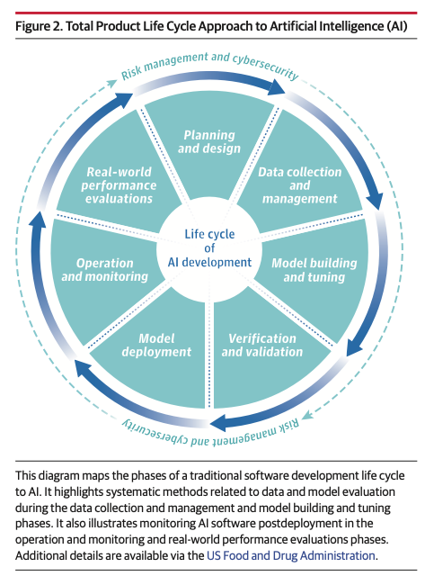
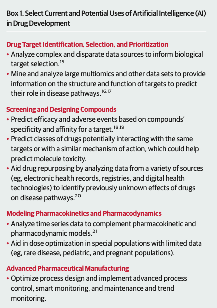
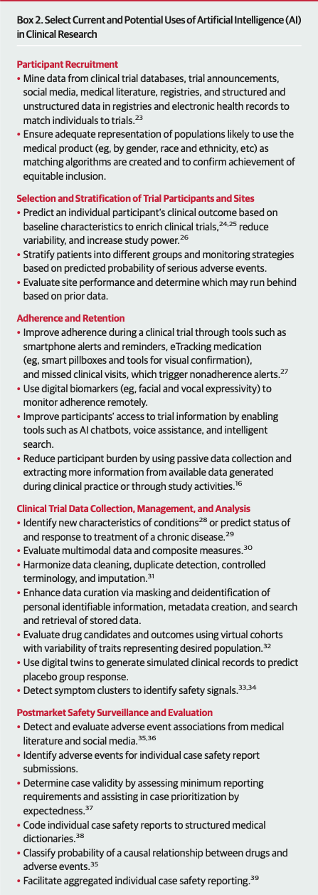

### Title
- FDA Perspective on the Regulation of AI in Health Care and Biomedicine
### Information
- Link
	- [https://jamanetwork.com/journals/jama/fullarticle/2825146](https://jamanetwork.com/journals/jama/fullarticle/2825146)
- Citation
	- Warraich HJ, Tazbaz T, Califf RM. FDA Perspective on the Regulation of Artificial Intelligence in Health Care and Biomedicine. JAMA. Published online October 15, 2024. doi:10.1001/jama.2024.21451
- Topic
	- US FDA
	- Medical AI
	- Regulation

### Abstract
- Importance
	- 의료 AI 제품에 대한 미국 FDA의 심사 이력과 의료제품 개발, 임상 연구, 임상 환경에서의 활용 가능성, 규제기관의 고려사항 등에 대해 리뷰함
- Observations
	- 미국 FDA는 거의 1000개 정도의 AI 활용 의료기기(AI enabled medical device)의 승인(authorized)을 내줌
	- 후보 물질 발견과 신약 개발에 활용되는 용도로 AI를 활용한 제품의 신청(submissions)은 몇백건임  
	- 규제 당국은 의료와 보건 분야에 AI가 활용되는 변화를 이해하고 유연하게 대응해야 하며 기업(Sponsor)도 제품 개발 단계에서의 투명성(transparent)을 담보해야 함
	- Life cycle management approach 가 시판후 관리(postmarket performance monitoring)에서 핵심임 
	- LLM(large language models)에 대해선 특별한 관리가 필요함 
	- FDA는 환자의 건강 결과(patient health outcome)에 초점을 두어 AI 활용을 통해 제품 개발자(developer), 구매자(payer), 보건 시스템(health system) 사이에 경제적 이익 극대화(financial optimization)를 서로 추구하려는 것에 대한 균형을 맞추어(balance) 주어야 함 

### The FDA's History of Regulating AI-Enabled Medical Products
- AI Applications
	- 스펙트럼이 다양
		- 단순한 알고리즘 적용에서 생성형 AI(generative AI tools) 활용까지 범위가 넓음
		- risk-based regulatory scheme에 기반한 유연한 대응이 필요 
- FDA 허가 History
	- PAPNET
		- 1995년 허가 받은 최초 (partially) AI-enabled emdical device
		- 경부암 오진단을 막기 위해 신경망(neural networks)을 활용한 소프트웨어
	- 그 후 약 1000 개의 AI-enabled medical device가 FDA 승인을 받음
		- 대부분 radiology 분야에 적용, 그 다음은 cardiology
	- AI를 신약 개발에 활용
		- 수백건 정도(hundreds of regulatory submissions) 신청이 됨
		- AI를 약물 discovery 및 development에 활용함
		- 2021년 132건의 application은 2020년에 비해 10배 정도 증가
		- AI in drug development 적용분야
			- 약물 개발 및 적응증 재 설정(enhancing drug discovery and repurposing)
			- 임상 시험 디자인 요소 결정(clinical trial design element)
			- 용량 최적화(dose optimization)
			- 약물 용법 준수(adherence to drug regimens)
			- 평가변수 및 바이오마커 평가(endpoint and biomarker assessment)
			- 시판후 감시(postmarket surveillance)
		- Oncology 분야에 가장 널리 활용, 다음은 정신과(mental health) 분야
	- FDA의 역할
		- 규제하는 산업 분야에서 AI의 안전하고 효과적인 사용이 되도록 감시
			- 규제 원칙을 업계가 준수(compliance)하도록 하는 동시에 혁신에 도움(fostering innovation)을 주어야 함 
		- 2021년 1월에 5-point action plan 발표
			- FDA.Artificialintelligence/machinelearning (AI/ML)-based software as a medical device (SaMD) action plan.
				- [https://www.fda.gov/media/145022/download](https://www.fda.gov/media/145022/download)
		- 21st Century Cures Act에 따라 Clinical decision-support software 등 여러 가이던스 발표함 
	- FDA의 4 focus
		- 공중 보건을 위한 협력에 도움(fostering collaboration to safeguard  public health)
		- 조화 표준, 가이드라인, 최적 사용례, 도구의 개발에 도움(promoting development of harmonized standards, guidelines, best practice, and tools)
		- 혁신에 도움이되는 고급 규제 전략의 개발(advancing development of regulatory approaches that support innovation)
		- AI 성능 평가와 모니터링에 도움이 되는 연구에 도움(supporting research related to evaluation and monitoring of AI performance)
### Concepts Pertinent to Regulation of AI by the FDA
#### AI regulation with the Broader US Govement and Global Context
- 국제적 기준 확립 및 협력을 위한 FDA의 활동
	- IMDRF 의 AI working group 공동 운영(co-lead)
	- AI 임상 연구 및 수행을 위한 ICH working group 참여 

#### Keeping Up with the Pace of Change in AI
- AI 활용한 제품의 심사를 위해 유연하고 과학에 기반한 규제 계획(adaptive, science-based regulatory scheme)이 필요함
- 의료기기에 대해서
	- TPLC Total Product Life Cycle 방식 도입함
		- 
	- 새로운 기술 적용을 위한 혁신적 프로그램(e.g., Software Precertification Pilot Program)에 대해서도 열려 있음

#### Flexible Approaches Across the Spectrum of AI Models 
- AI 활용 제품의 스펙트럼이 다양함
	- 위험도에 기반한 접근이 필요(risk-based approach)
		- 위험도가 높을수록 규제 필요성이 더 올라감
- 예시: Sepsis ImmunoScore (Prenosis, Inc)
	- Class II device로 De Novo classification으로 허가를 2024년 4월에 받음
		- [https://www.accessdata.fda.gov/cdrh_docs/pdf23/DEN230036.pdf](https://www.accessdata.fda.gov/cdrh_docs/pdf23/DEN230036.pdf)
	- EHR에서 22개의 정보(predetermined inputs)를 받아 환자의 패혈증 sepsis 발생 위험도를 식별하는 제품
	- 이런 제품의 안전성과 유효성을 보장하기 위한 special control이 필요함 
#### The Use of AI in Medical Product Development
- 의료 제품의 개발에 AI가 활용 잠재성이 높음
	- 타겟 약물 식별, 선별 및 후보물질 선별, PK/PD 모델링 등에 적용 
	- Box1
		- 
- FDA 규제 담당자는 개발된 최종 제품의 이점이 위험도보다 더 높은 지(benefits outweigh its risk for that intended use) 적절히 평가할 수 있어야 함 
- 임상 연구 및 시판 후 감시와 평가에도 AI 활용이 가능함 
	- 환자 모집, 임상 시험 관리, 임상 자료 수집, 시판 후 조사 와 평가에 적용
	- Box2 
		- 

#### Preparing for the Unknowns of LLMs and Generative AI
- 허가받은 LLM 제품은 아직 없음
	- LLM(Large Language Models)이 복잡하고 output도 다양하기 때문에 평가를 위한 특별한 도구가 필요함
- EHR, wearable digital health 기술과 접목되어 활용할 잠재성이 높음
	- 규제적 혁신(regulatory innovation)을 통해 임상적 판단 결정(clinical decision-making)에 LLM이 도움이 될 수 있도록 해야 함 

#### The Central Importance of AI Life Cycle Managment
- AI 성능(AI performance)은 실제로 사용되는 환경에서 평가되어야 함
	- 시판후 AI 성능 평가(postmarket performance monitoring of AI)가 필요함 
#### The Responsibilities of Regulated Industries
- FDA의 규제 대상인 산업군은 FDA가 요구하는 법령과 요건들을 반드시 준수해야 함 
	- by responsible conduct and quality management by sponsors
- AI 적용할 때의 환자의 건강상 유익 health benefit의 평가가 필요함
	- 제품 시판 후(after deployment) 성능을 평가하는 과정이 현재 부족함 
		- AI가 점점 더 많이 활용될 수록 이 부분에 대한 평가, 조사가 더 필요해질 것임

#### Maintaining Robust Supply Chains
- 제품 공급망(supply chain) 관리에도 AI가 필수적으로 활용될 것임
	- 자연재앙, 전쟁 등으로 상황이 바뀔 때에도 빠른 회복이 가능한 시스템 구축을 해야 함
	- 이런 AI 기술 적용에 따른 사이버보안 취약점 최소화도 필요

#### Finding the Balance Between Big Tech, Start-Ups, and Academia
- AI의 상업적 활용을 주도하고 있는 큰 테크 기업과 의료 분야에 기여하려는 많은 작은 start-up 이 개발한 AI model의 안전하고 효과적인 사용이 보장되어야 함 
	- small business와 학계(academia)를 특별히 돕기(special initiatives) 위한 FDA의 프로그램은 AI에도 적용됨 

#### The Tension Between Using AI to Optimize Financial Returns vs Improving Health Outcomes
- AI 기술을 활용한 제품을 만드는 주체의 ROI(Return on Investment)가 환자에게 더 나은 결과(better patient outcome)와는 상충될 수 있음 
	- FDA는 국민 보건 발전 및 의과학적 혁신에 대한 강한 목표가 있음(strong mission to both advance public health and biomedical innovation)
- AI 활용이 경제적인 이익(financial retrun on investment)에만 집중되어 개발되지 않도록 해야함
- AI의 임상적 적용이 환자에게 도움이 될 수 있도록 임상의(clinicians)의 역할이 중요함 
- 의도적으로, 건강 관련 지표(health outcome)에 집중되도록 하는 것이 예견되는 역작용(health care system의 부담 증가, 환자 효용성 감소, 데이터 독점 등)을 줄이는 데 필요할 것임. 

### Conclusions
- AI 기술은 빠르게 발전하고 있고 이 적용의 확대에 FDA의 역할이 점점 커질 것임
- 규제 산업군(regulated industries), 학계, FDA 모두 함께 의료 및 의과학(health care and biomedicine) 분야에서 AI 적용의 안전성과 유효성을 평가하고 최적화할 도구를 만들어가야 함 

