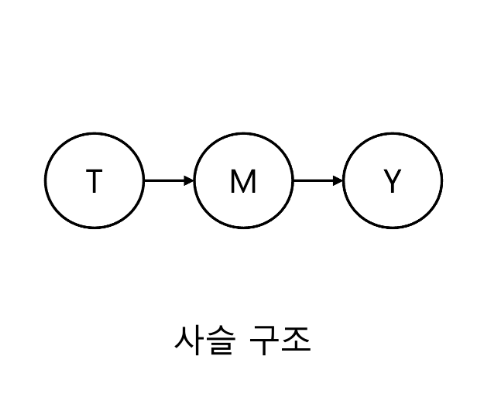
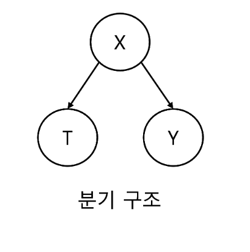
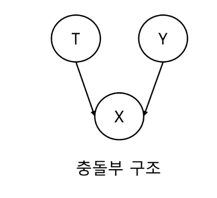

On October 16th, we had the Pseudo Lab's RWE guideline study. It was the final week covering causal inference concepts. Next week, we'll cover the FDA framework guidelines. This week's topics were statistics review and graphical causal models. [Jaeyun Choi](https://www.linkedin.com/in/jaeyun-choi-0b64292a0/) prepared and presented the materials.

In the statistics review, we looked at point estimation, interval estimation, and hypothesis testing. We studied materials from 'Causal inference for brave and true,' which is generally well-explained, but the explanation of the central limit theorem was somewhat lacking.

It was explained as follows:
'The central limit theorem states that when the sample size is sufficiently large, regardless of the population distribution, the distribution of sample means used to estimate the population mean follows a normal distribution. Therefore, we can calculate confidence intervals for the population mean using the properties of normal distribution.'

In fact, this theorem only holds when the population distribution's mean and variance exist. For example, consider distributions following Pareto's law. The distribution of people's wealth also follows Pareto's law, where the mean is infinite. Another example is the Cauchy distribution. In medical papers' Table 1, we calculate means and standard deviations of variables by group and test for mean differences, but we often use non-parametric tests because the central limit theorem doesn't always apply to non-parametric distributions.

In the graphical model section, we covered three causal graph structures:

Chain structure with mediating effects, as seen in mediation analysis (where only direct effects exist). T causes M, and M causes Y, expressed as:
T -> M -> Y

If we condition on (or adjust for) M, T and Y become independent. Usually, M isn't adjusted, but depending on research objectives, T and Y might be made independent.

Fork structure, where the concept of confounders appears. This structure refers to common causes. X is a common cause of T and Y, making X the confounder. Proper adjustment of confounders is necessary to understand T's effect on Y. For example, X could be a country's GDP, T could be per capita chocolate consumption, and Y could be the number of Nobel Prize winners. When higher chocolate consumption correlates with more Nobel Prize winners, it's difficult to determine if this is due to chocolate consumption or because countries with high chocolate consumption also have high GDPs. Therefore, it's good to examine Nobel Prize winners by chocolate consumption while controlling for GDP.

Collider structure, where T and Y are causes of X, making X the collider. When T and Y have no causal relationship, conditioning on X creates an association between T and Y. For example, let T be statistical knowledge, Y be flattery, and X be promotion. If someone got promoted, they either have good statistical knowledge or are good at flattery. If we learn they lack statistical knowledge, we can infer they're good at flattery. Thus, conditioning on X (promotion) creates an inverse relationship between statistical knowledge and flattery.

We also covered selection bias, which occurs when controlling for more variables than necessary. Jaeyun provided two examples:
First example: A randomized experiment asking whether looking at the sky influences others to look up too. While randomization prevents confounding, can we determine causality between looking up and others following suit? Shy people might not participate in the study, making generalization difficult. This case has internal validity but lacks external validity.

Second example: Per protocol set analysis, which only includes participants who adhered well to the clinical trial protocol. If the treatment group has many dropouts due to harsh side effects, selection bias occurs. This case lacks internal validity.

Presentation material : [https://causalinferencelab.github.io/Bridging-Causal-Inference-and-Real-World-Evidence-A-Study-of-FDA-and-Other-Regulatory-Guidelines/docs/causal_inference_part2.html](https://causalinferencelab.github.io/Bridging-Causal-Inference-and-Real-World-Evidence-A-Study-of-FDA-and-Other-Regulatory-Guidelines/docs/causal_inference_part2.html)

Source: [Original Korean article](https://tea-tasting-statisticians.github.io/posts/Causal_inference_part2/) \| English translation by Claude 3.5 Sonnet (New)
