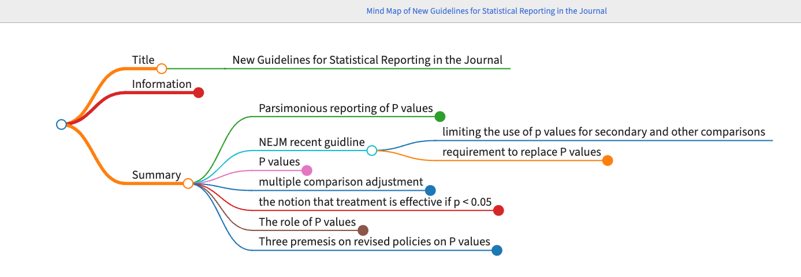

### Title
- New Guidelines for Statistical Reporting in the Journal

### Information
- Link
	- https://www.nejm.org/doi/full/10.1056/NEJMe1906559
- Citation
	- Harrington, D., D’Agostino Sr, R. B., Gatsonis, C., Hogan, J. W., Hunter, D. J., Normand, S. L. T., ... & Hamel, M. B. (2019). New guidelines for statistical reporting in the journal. _New England Journal of Medicine_, _381_(3), 285-286.
- Topic
	- Statisitcal reporting
	- Medical journal

### Summary
- Parsimonious reporting of P values 
	- e.g., VITAL trial
		- two by two factorial, placebo controlled, randomized trial
		- whether Vitimin D or omega 3 prevent cardiovascular disease or cancer
		- 2 prespecified outcomes and 
		- 22 prespecified and other secondary outcomes
			- only reported the hazard ratios and CI for the intervention effects for these outcomes
- NEJM recent guidline
	- limiting the use of p values for secondary and other comparisons
	- requirement to replace P values
		- with estimates of effects or association
			- and 95% confidence intervals
			- when neither the protocol nor the statistical analysis plan has specified methods
				- to adjust for multiplicity 
- P values
	- how incompatible the observed data may be with a null hypothesis
	- p < 0.05 implies that 
		- treatment effect or exposure association larger than that observed would occur less than 5% under a null hypothesis of no effect or association
		- assuming no confounding 
	- type I error
		- the null hypothesis is false when in fact it is true 
	- without adjustment for multiplicity,
		- the probability of declaring a treatment difference when none exsists can be much higher than 5% 
	- do not represent the probability that the null hypothesis is false 
	- provide no information about
		- the variability of an estimated association (its standard error)
		- non-significant p values do not distinguish between group differences that are truely neglible and group differences that are noninformative becuase of large standard errors 
		- size of an effect or association 
- multiple comparison adjustment
	- is available
	- to control the type I error probability in an anlysis when specified in the design of a study 
- the notion that treatment is effective if p < 0.05
	- reductionist view of medicine that does not always reflect reality 
- The role of P values 
	- Well-designed randomized or observational study with primary hypothesis and prespecified method of analysis
		- the significance level from that analysis is a reliable indicator of to which the observed data contradict a null hypothesis of no association between an invervention or an exposure and a response 
	- P values have a role in those decisions
		- clinicians and regulatory agencies must make decisions about which treatment to use or to allow to be marketed 
- Three premesis on revised policies on P values
	- it is important to adhere to a prespecified analysis plan
	- the use of statistical thresholds for claiming an effect or association should be limited to analysis for which the analysis plan outlined a method for controlling type I error
	- the evidence about the benefits and harms of a treatment should include both point estimates and their margins of error 
