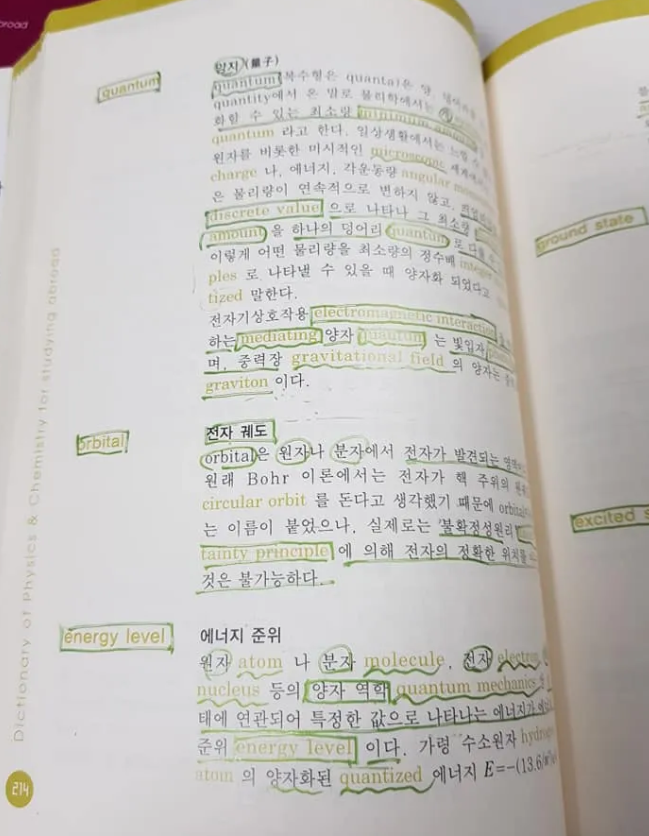

---
title: 데이터 사이언스 분야 영어 실력 늘리는 Tip 
date: 2025-04-13
categories: [KOR, tip (KOR)]
tags: [tip]     # lower case 
author: <Tea Tasting Lady>
math: true
--- 

커뮤니티 모임 등에서 제가 자주 하는 조언 중의 하나가 영어공부를 열심히 하라는 것입니다.

영어로 된 자료를 검색하고 읽는 게 부담이 없을 정도의 영어 실력이 있다는 것은 영어 텍스트 자체를 보는 게 골치 아파 들여다볼 엄두조차 내지 않는 것에 비하면 매우 큰 경쟁력입니다. AI 검색 엔진을 활용할 때도 영어로 질문을 하고 영어로 얻어지는 검색 결과가 더 낫기도 합니다.  

데이터 사이언스와 관련한 영문 텍스트의 독해가 어렵다는 건 문장 구조가 복잡하거나 길어서 어렵다기보다는 대부분은 영어 어휘를 늘리면 해결할 수 있는 경우가 많습니다. 

영문 시사 칼럼이나 영어 소설 등을 읽다보면 한 문장이 5~6줄로 엄청 길다거나 단어 자체는 쉬운 데 읽다보면 중의적으로 쓰이는 단어의 의미가 또렷하지 않아 해석이 어려운 경우가 있는데, 데이터 사이언스 쪽 영문 자료나 과학 관련 서적은 단어 Vocabulary가 얕아서 독해가 어려운 경우가 더 많습니다. 

이런 경우에, 아래에 소개하는 생물, 물리.화학.수학 핵심 용어사전 같은 책들로 영어 단어와 한국어 단어, 개념 설명까지 함께 익히면 여러모로 유용합니다. 아래 사진은 물리.화학 용어 사전의 한 페이지입니다. 영어 단어, 대응되는 한국어 단어, 개념 설명 의 형식으로 정보를 제공하고 있습니다. 

이 책들은 제가 미국 학부 생물학과 편입 전에 구입해서 읽었었는데 시간이 꽤 흘렀음에도 여전히 판매되고 있습니다. 구매 링크 아래에 공유합니다. 

* 생물 핵심용어사전
	* [생물 핵심용어사전](https://search.shopping.naver.com/book/catalog/32436131630)
* 물리 화학 핵심용어사전
	* [물리화학 핵심용어사전](https://search.shopping.naver.com/book/search?bookTabType=ALL&pageIndex=1&pageSize=40&query=%EB%AC%BC%EB%A6%AC%ED%99%94%ED%95%99%ED%95%B5%EC%8B%AC%EC%9A%A9%EC%96%B4%EC%82%AC%EC%A0%84&sort=REL)
* 수학 핵심 용어사전
	* [수학 핵심용어사전](https://search.shopping.naver.com/book/catalog/32441619265?query=%EC%88%98%ED%95%99%20%ED%95%B5%EC%8B%AC%20%EC%9A%A9%EC%96%B4%20%EC%82%AC%EC%A0%84&NaPm=ct%3Dm9fkn7ko%7Cci%3D1ea00173bc5e539b5bc08169ab6b1fbdd8d94b9e%7Ctr%3Dboksl%7Csn%3D95694%7Chk%3D148397e2724ba2364c3b31ece9a858c671e40ddc)

관심 있는 분야의 영어 원서를 한두권 끝까지 꼼꼼히 단어를 찾아가면서 읽어보는 것도 좋은 방법입니다. 너무 영어 단어를 모른다 싶으면 위에 소개한 관심 분야 용어 사전 등을 한번 훑어보고 영어 텍스트를 접해보면 영어 자체가 부담스러운 이슈는 훨씬 줄어듭니다. 

읽고 싶은 데이터 사이언스 내용 자체가 어려운 건 또 다른 문제이지만 일단 영어 텍스트 자체를 접하는 게 너무 부담되지는 않을 정도의 자신감, 실력을 다지는 것은 매우 중요합니다. 

일반적인 어휘 실력 향상을 위해서는 토플 시험 준비용 Vocabulary List도 추천합니다. 토플 시험은 영어권 대학, 대학원 진학을 희망하는 학생들의 영어 실력을 평가하기 위한 시험으로,  주로 비지니스 업무 상황의 영어 실력을 평가하는 토익 시험 대비용 Vocabulary보다는 다루는 어휘 범위가 넓습니다.  

Word Smart나 Vocabulary 33000 처럼 SAT/ GRE 시험 대비용 Vocabulary는 단어들이 너무 어렵기도 하고 잘 안 쓰는 단어들이 많아서 추천하지 않습니다.

Word Smart, Vocabulary 33000 이런 list에 속한 단어들도 공부하다보면 어휘 실력이 일취월장하는 뿌듯함도 있고 일단 이런 list까지 통달하면 더이상 어휘 관련해서 도전해볼만한 list는 딱히 없어지는 경지에 이르게 되긴 합니다만... 미국 대학원 진학을 위한 GRE 시험을 치기 위한 목적이 아니고서야 드는 노력에 비해 실용적이진 않습니다.

데이터 사이언스 분야의 영어 자료를 웹에서 자주 접하고 듣고 읽는 것도 추천합니다. 제가 추천하고 싶은 싸이트 몇개 소개합니다. 

-  Quantamagazine 
	- 물리학, 수학, 생물학, 컴퓨터 과학 등 여러 과학 분야의 최신 소식들이 훌륭한 graphic 과 함께 기사 article 로 소개되곤 합니다. 무료이고 업데이트 주기도 꽤 빠릅니다. 
		- [https://www.quantamagazine.org/](https://www.quantamagazine.org/)
- Medium
	- 여러 topic 의 영문 블로그를 접할 수 있는 곳입니다. 코딩, 데이터 사이언스 뿐만 아니라, 심리학, fitness 등의 글도 흥미롭게 읽곤 합니다. 제한없이 모든 글들을 읽으려면 유료입니다. 
		- [https://medium.com/](https://medium.com/)
- 3Blue1Brown
	- 수학 관련 유명한 유튜브 채널입니다.애니매이션을 활용하여 여러 어려운 개념들을 최대한 직관적으로 설명합니다. 
		- [https://www.youtube.com/@3blue1brown/featured](https://www.youtube.com/@3blue1brown/featured)

영어 실력을 늘리기 위해 많이 읽고 많이 써보고 많이 듣고 많이 말해보라는 것 외에 특별한 지름길은 없습니다. 본인이 하기에 따라 차이가 크게 나는 기본 skill 중의 하나가 영어 실력입니다. 쉽고 빠르지는 않더라도 차곡차곡 꾸준히 하다보면 유학이나 어학연수 등의 방법 말고도 영어 실력을 키워나가는 것에 이 글이 도움이 되면 좋겠습니다. 