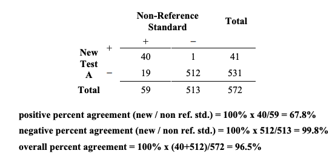
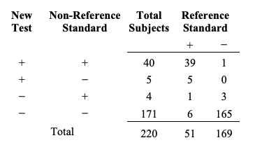

---
title: FDA Guidance Statistical Guidance on Reporting Results from Studies Evaluating Diagnostic Tests 
date: 2025-06-28
categories: [KOR,Clinical Trial Designs]
math : true
tags: [clinical trial]     # TAG names should always be lowercase
author: <Tea Tasting Lady>
math: true
--- 

US FDA Guidance "Statistical Guidance on Reporting Results from Studies Evaluating Diagnostic Tests"을 전문 번역한 글로  예전에 제가 업무 관련해서 번역했었습니다.

**US FDA GUIDANCE 원 문서 파일 링크** 
**([https://www.fda.gov/regulatory-information/search-fda-guidance-documents/statistical-guidance-reporting-results-studies-evaluating-diagnostic-tests-guidance-industry-and-fda](https://www.fda.gov/regulatory-information/search-fda-guidance-documents/statistical-guidance-reporting-results-studies-evaluating-diagnostic-tests-guidance-industry-and-fda))**

# **진단 검사를 평가하는 연구 결과의 보고에 대한 통계적 지침**

## **1. Background**

## **1. 배경**

이 지침(guidance)은 진단 검사(diagnostic tests)를 평가하는 서로 다른 연구들의 결과 보고를 위해 통계적으로 적절한 관례(practices)를 기술하고 몇몇 흔한 부적절한 관례를 식별하는 데 그 목적이 있다. 이 지침의 권고사항들은 최종 결과가 질적(qualitative)인 진단 검사(기저 측정치는 양적(quantitative)이라 할지라도)와 관련이 있다. 우리는 불일치 해결(discrepant resolution)이라 불리는 관례와 이와 연관된 문제에 대해 특별히 주의를 집중하였다.

1998년 2월 11일에, CDRH(Center for Devices and Radiological Health)는 미생물학, 혈액학/병리학, 임상 화학/독성학 그리고 면역학 기기 패널의 공동 회의(joint meeting)를 소집하였다. 이 회의의 목적은 “새로운 기기가 잘 알려진 참조 방식 또는 ‘gold standard'인 다른 기기 혹은 흔하게 사용되지 않는 다른 절차와/또는 진단을 위한 임상적 판단기준(clinical criteria)과 비교될 때 체외 진단기기(in vitro diagnostic devices) 사용을 위한 적응증을 뒷받침하기 위해 탄탄한 과학적, 통계적 분석을 사용하여 적절한 데이터 수집, 분석, 그리고 불일치 결과의 해결”에 대한 권고사항을 얻는 것이었다. 그 회의의 조언(input)을 사용하여, 새로운 진단기기에 대한 평가 연구 결과를 보고하는 데 있어서 통계적으로 타당한 일부 방식들을 논의하는 초안 지침 문서(draft guidance document)가 개발되었다. 이 초안 지침은 2003년 3월 12일에 공적인 의견(public comment)을 얻기 위해 배포되었다.

이 초안 지침의 출판 후에, FDA는 11건의 의견을 받았다. 전반적으로, 의견은 호의적이었고 최종 지침에 추가적인 정보가 포함될 것을 요구하는 내용이었다. 일부 응답자들은 표준 용어(standard terminology)의 사용에 더 주의를 기울여달라고 요구하였다.

성능(performance) 결과를 설명하기 위한 용어의 올바른 사용이 진단기기의 안전하고 효과적인 사용을 보장하기 위해 중요하다. 언제든 가능한 대로, 이 지침은 Clinical and Laboratory Standards Institute (CLSI) Harmonized Terminology Database에 수집되어 있는 대로 국제적으로 용인되는 용어와 정의를 사용하였다. 이 지침은 또한 STARD(STAandards for Reporting of Diagnostic Accuracy) Initiative에 정의된 대로 용어들을 사용하였다. STARD Initiative에서는 진단기기 동등성(equivalence)를 보이기 위해 디자인된 연구들을 특별히 다루고 있지는 않지만, 보고 개념(reporting concepts)의 대다수는 여전히 적용 가능하다.

이 가이드 문서를 포함한 FDA의 지침 문서들은 법적으로 강요되는 책임에 대해 다루고 있지 않다. 대신에, 지침 문서들은 기관이 현재 이 토픽에 대해 가지고 있는 관점을 묘사하고 있으며 특정한 규제 또는 법에 명시된 요구 사항(statutory requirements)이 인용되어 있지 않은 이상은 권고사항으로만 받아들여져야 한다. 기관의 지침서에 ‘해야한다(should)'란 단어를 쓰는 것은 어떠한 것이 제안되거나 권고된다는 의미이지 요구된다는 의미는 아니다.

우리는 의료 기기 규제의 모든 분야에 가장 부담이 덜한 방식(the least burdensome approach)를 고려해야 한다고 믿는다. 이 지침서는 적절한 과학적, 법적 요구조건에 대해 우리가 신중히 검토한 것과 이러한 요구조건을 따를 때 가장 부담이 덜한 방식이라고 우리가 믿는 사항들을 반영하고 있다. 하지만 만약에 당신이 부담이 더 덜한 대체 방식이 있다고 생각한다면 우리가 당신의 관점을 고려해볼 수 있도록 우리에게 연락을 주기 바란다. 당신이 기술한 의견을 이 지침서의 서안(preface)에 명시된 직원에게 송부하거나 CDRH 옴부즈맨(Ombudsman)에 송부할 수 있다. 의견을 전달할 수 있는 방식을 포함하여 CDRH의 옴부즈맨에 관한 전반적인 정보는 http://www.fda.gov/cdrh/ombudsman/ 에서 볼 수 있다.

## **2. Scope**
## **2. 범위**

이 문서는 진단기기(검사)에 대한 premarket notification(510(k))과 premarket approval(PMA) 신청의 제출을 위한 지침서를 제공한다. 이 지침서는 PMA와 510(k)에서 두 가지 가능한 결과(양성 또는 음성)를 가지는 진단기기를 평가하는 여러 유형의 연구들로부터의 결과를 보고하는 방식을 다루고 있다.

이 지침서는 진단기기에 대한 임상 연구의 디자인과 모니터링과 연관된 근본적인 통계적 이슈들은 다루고 있지 않다.

## **3. Introduction**
## **3. 소개**
이 섹션에서는 이 지침서와 관련된 개념들의 설명을 다루고 있다. 우리는 처음에 새로운 진단 검사의 평가에는 의도된 사용군(intended use population), 즉 , 그 검사가 사용되도록 의도된 대상자들/환자들로부터 적절하고 관련된 진단 기준점(benchmark)에 대해서 새로운 기기의 결과(검사 결과)를 비교해야 한다고 주지한다. STARD에서, 이것은 목표군(target population)이라고 불린다.

그 외 중요한 개념과 정의는 다음과 같다:

### **Types of test results**
### **검사 결과의 유형**

 비교 방법은 검사 결과의 성격에 따라 달라진다. 진단 검사 결과(outcomes)는 대개 양적(quantitative)이나 질적(qualitative) 결과 중의 하나로 분류된다. 양적 결과는 수치적 량이나 수준인 반면에 질적 결과는 대개 두가지 가능한 반응 중의 하나로 이루어져 있다; 예를 들어 병이 있음 또는 병이 없음, 양성 또는 음성, 예 또는 아니오. 이 문서는 최종 결과가 질적인 진단 검사(기저 측정치가 양적이라 할지라도)와 관련이 있다. 양적 검사와 순위 결과의 검사(결과가 두 가지 이상이지만, 순위(ordered)가 매겨진 것)는 이 문서에서 다루어지지 않았다.

   우리는 또한 당신의 연구 데이터가 한 환자로부터의 여러(multiple) 표본을 포함하지는 않는다고 가정하였다.

### **Purpose of a qualitative diagnostic test**
### **질적 진단 검사의 목적**

   질적 진단 검사(검사 test)는 목표 질환(target condition)이 의도된 사용군의 대상자에게 있는 지 또는 없는 지를 판정하기 위해 디자인 되었다. STARD에 정의된 것처럼, 목표 질환(target condition) (관심 질환(condition of interest))은 “특정 질병, 질병 단계(disease stage), 건강 상태 또는 이미 있는 것으로 알려진 질병의 단계를 판정하는 것이나 치료의 시작, 수정 또는 종료와 같은 임상적 행위를 촉발할 수 있는 건강 상태와 같은 환자 내에서 그 외 다른 식별 가능한 상태를 칭한다.”

   FDA는 모든 의도된 사용자들(실험실, 보건 종사자, 그리고/또는 가정 사용자)이 사용할 수 있도록 진단 성능을  Labeling 에 구체화할 것을 권고한다.

### **Benchmarks**
### **기준점**

   FDA는 새로운 질적 진단검사의 진단 성능을 평가하기 위한 기준점에는 두가지 주요 범주가 있다는 것을 인식하고 있다. 이러한 범주에는 (1) 참조 표준(reference standard) (아래에 정의)과의 비교, 또는 (2) 참조 표준 외의 방식이나 속성(predicate)과의 비교(비-참조 표준). 비교 방식의 선택이 라벨에 어떤 성능 척도(performance measures)가 보고되어야 할지를 판정할 것이다.

### **Diagnostic accuracy and the reference standard**
### **진단 정확도와 참조 표준**

   새로운 검사의 진단 정확도(diagnostic accuracy)는 새로운 검사와 참조 표준 결과의 일치 정도를 지칭한다. 우리는 STARD에 정의된 대로 용어 참조 표준을 사용한다. 즉, 참조 표준(reference standard)은 “목표 질환의 유무를 확립하기 위해 사용가능한 최선의 방식이라고 간주되는 것”이다. 이것은 의도된 사용군을 두 개의 군으로만(질환이 있음 또는 없음) 나누며 평가 대상인 새로운 검사의 결과는 고려하지 않는다.

   참조 표준은 단일 검사 또는 방식이거나 임상적 추적조사를 포함하여 방식과 기술(techniques)의 조합일 수도 있다. 만약 참조 표준이 방식들의 조합이라면, 어떻게 다른 결과치가 조합되어 최종적으로 양성/음성 분류 결과를 낳는지를 명시하는 알고리즘(이러한 방식들의 선택과 순서를 포함할 수도 있음)은 그 표준의 일부이다. 참조 표준의 예에는 WHO(World Health Organization) 표준을 사용한 심근 경색의 진단, American Rheumatology 가이드라인을 사용한 루푸스 또는 류마티스성 관절염의 진단 또는 배양, 조직학 그리고 우레아제(urease) 검사의 조합을 사용한 H. pylori 감염의 진단 등이 있다.

   무엇이 “최선의 사용가능한 방식(best available method)"을 구성하며 그 방식이 “참조 표준(reference standard)"으로 간주되어야 하는지의 여부는 의학계, 실험실, 그리고 규제 당국 내의 의견과 관례에 의해서 확립된다. 가끔 고려될 수 있는 여러 가능한 방식들이 있다. 가끔은 합의된 참조 표준이 존재하지 않는다. 또는, 참조 표준이 존재하긴 하지만, 의도된 사용군의 무시할 수 없을 정도의 비율에서 그 참조 표준에 에러가 있음이 알려져 있을 수도 있다. 이러한 모든 상황에서, 우리는 당신의 연구를 시작하기 전에 참조 표준의 선택에 관해 FDA와 상의할 것을 권장한다.

   우리는 진단 정확성(diagnostic accuracy)에 관한 일부 정의(CLSI harmonized terminology database 참조)에는 참조 표준과 목표 질환이 잘-정의된(well-defined) 임상적 장애(clinical disorder)만을 칭하는 것이 요구된다는 점을 지적하고자 한다. 이 문서에서 사용되는 정의는 범위가 더 넓다. 예를 들어, 목표 질환은 잘-정의된 건강 상 상태나 치료의 시작과 같은 임상적 조치를 촉발하는 상태를 의미할 수 있다.

### **Measures that describe diagnostic accuracy**
### **진단 정확성을 설명하는 척도들**

   진단 정확성을 설명하는 데는 여러 방식이 있다. 적절한 척도에는 민감도와 특이도 쌍(pair)의 추산, 양성과 음성 결과 쌍의 우도비(likelihood ratio), 그리고 신뢰구간과 함께 ROC(Receiver Operating Characteristic) 분석을 하는 것 등이 있다. CLSI Approved Guidelines EP12-A와 GP10-A의 최신판; Lang and Secic (1997), Pepe (2003), Zhou et al. (2002)가 쓴 문헌; 이러한 문헌의 참조문헌; 그리고 이 문서 끝부분의 참고문헌 목록(bibliography)을 참조하라. 이러한 척도의 해석을 돕기 위해서, 우리는 관심 질환의 정의, 참조 표준, 의도된 사용군, 그리고 연구군의 설명의 제시를 권장한다.

### **Sensitivity and specificity**
### **민감도와 특이도**

   진단 정확성의 연구에서, 새로운 검사의 민감도(sensitivity)란 목표 질환이 있는 대상자 중에 검사 결과가 양성으로 나온 대상자의 비율로 추산된다. 유사하게, 검사의 특이도(specificity)란 목표 질환이 없는 대상자 중에 검사 결과가 음성으로 나온 대상자의 비율로 추산된다 (이러한 계산의 예는 Appendix를 참조). 이것들은 민감도와 특이도의 추정치(estimates)에 불과한데, 왜냐하면 이 수치들은 의도된 사용군 대상자의 부분집합(subset)에만 기반하여 계산되었기 때문이다; 만약 대상자의 또다른 부분집합이 검사된다면(또는 심지어 다른 시점에 동일한 대상자에 대해 검사가 이루어진다 할지라도), 민감도와 특이도의 추정치는 아마도 수치적으로 다를 것이다. 신뢰 구간(confidence intervals)과 유의 수준이 대상자/표본 선택 과정에 따른 이러한 추정치들의 통계적 불확실성(uncertainty)를 정량화한다. 이러한 유형의 불확실성은 연구의 대상자 수가 증가함에 따라 감소한다.

### **Positive and negative predictive value**
### **양성 그리고 음성 예측도**

   당신은 또한 진단 정확성을 특성화하는 데 도움을 주는 다른 수치를 계산할 수도 있다. 이러한 방법들에는 양성 결과의 예측도(양성 예측도(positive predictive value) 또는 PPV라고 불림)와 음성 결과의 예측도(음성 예측도(negative predictive value) 또는 NPV라고 불림) 쌍이 포함된다. 이러한 양은 시험 결과를 어떻게 해석할 수 있을 지에 대해 유용한 통찰력을 제공해 준다. 당신은 또한 이러한 척도를 어떻게 계산하고 해석할 수 있을 지에 대해 광범위한 문헌을 참조할 수도 있다. (CLSI Approved Guidelines EP12-A와 GP10-A의 최신판; Lang and Secic (1997), Pepe (2003), Zhou et al. (2002)가 쓴 문헌; 이러한 문헌의 참조문헌; 그리고 이 문서 끝부분의 참고문헌 목록(bibliography)을 참조하라.) 이러한 척도에 대한 추가적인 논의는 이 문서의 범위 밖이다.

### **Bias**
### **편의**

민감도와 특이도 추정치(그리고 진단 성능의 다른 추정치들)는 편의가 생길 수 있다. 편의가 있는 추정치(Biased estimates)는 체계적으로 값이 너무 높거나 너무 낮다. 편의가 있는 민감도와 특이도 추정치는 평균적으로 실제 민감도와 특이도와 동일하지 않을 것이다. 종종 편의의 존재, 크기(정도), 그리고 방향은 판정할 수 없다. 편의는 부정확한 추정치로 이어진다.

   FDA는 편의를 없애거나 최소화하기 위해서 편의의 잠재적 원인을 이해하는 것이 중요하다고 믿는다. 단순히 연구의 전반적인 대상자수를 늘리는 것이 편의를 줄이는 데는 전혀 소용이 없을 것이다. 대안적으로, “올바른(right)" 대상자의 선택, 연구 수행이나 데이터 분석 절차를 바꾸는 것이 편의를 제거하거나 줄일 수 있다.

   이 지침 개발의 원(originally) 동기가 된 편의의 두 가지 원인에는 참조 표준의 에러와 목표 질환을 확립하기 위한 평가 하에서의 검사 결과를 통합시키는 것이 포함된다. 이 지침은 편의의 이러한 원인과 그 외 원인으로부터 생기는 문제들을 논의하고 당신의 연구 디자인과 데이터 분석에서 이러한 문제들을 어떻게 최소화 할 수 있을 지에 대해 설명한다. 이 지침은 편의의 모든 가능한 원인들과 어떻게 그것들을 피할 수 있을 지에 대해서 논의하고자 시도하지는 않는다. 편의와 진단 기기 연구에 관한 통합적인 논의에 대해서는 Begg (1987), Pepe (2003), Zhou et al. (2002)와 이러한 문헌에 인용된 참조문헌들을 참조하라.

### **When a non-reference standard is used for comparison**
### **비-참조 표준이 비교를 위해 사용되었을 때**

  새로운 검사가 비-참조 표준과의 비교에 의해 평가되었을 때, 민감도와 특이도는 이 비교 결과를 설명하기 위해 적절한 용어가 아니다. 새로운 검사의 정확도(accuracy) 또는 “올바름(correctness)"에 관한 정보는 직접적으로 추산될 수 없다. 대신에, 비-참조 표준이 비교를 위해 사용되었을 때, FDA는 당신이 후보 검사(candidate test)가 비교 방법이나 기존 방법과 충분히 일치한다는 것을 제시하라고 권장한다. 이 문서에서 다루고 있는 질문은 비교 방법이 참조 표준이 아닐 때 새로운 진단 검사를 평가하는 연구의 결과를 어떻게 보고하는 지에 대한 것이다.

## **4. Benchmark and Study Population Recommendations**
### **4. 기준점과 연구군 권장사항들**

FDA는 첫 시료를 수집하거나 첫 측정을 하기 전에 당신의 연구를 신중하게 계획할 것을 권장한다. 이 계획에는 진단 정확성 또는 기기 일치도를 보고할 것인지 여부를 판정하는 것이 포함된다. 만약 당신이 진단 정확성을 보고하고자 한다면, FDA는 최소 일부 대상자에 대해서 참조 표준을 사용하는 것을 평가에 포함하라고 권장한다.

우리는 임상 연구의 어떤 데이터 수집이 이루어지기 전에 가능한 연구 디자인과 통계 분석에 관해 당신이 CDRH와 조기에 연락할 것을 권장한다. 종종 적절하게 사용될 수 있는 유망한 고급(promising adavanced) 통계 방식이 있을 수 있으며, 새로운 통계 분석 기술이 끊임없이 개발되고 있다. 이 문서 끝에 있는 참조문헌의 목록에는 여러 접근방식들을 포함하고 있다. 연구를 시작하기 전에 당신의 계획된 연구를 CDRH와 논의하는 것이 시간과 돈을 아낄 수 있다.

### **4.1 Comparisons with the Benchmark**
### **4.1 기준점과의 비교**

   비교 기준점(comparative benchmark)과 비교와 보고 방식의 선택은 참조 표준의 존재 여부와/또는 실제적 적용성(practical applicability)에 영향을 받는다. 참조 표준의 사용성에 따라, FDA는 비교 기준점의 선택에 관한 다음 권고사항을 제시한다:

           1. 만약 참조 표준이 사용가능하다면: 
           - 이것을 민감도와 특이도를 추정하는 데 사용하라
           2.  만약 참조 표준이 사용가능하지만 적용가능하지 않다 (impractical):       
           - 이 것을 가능한 만큼 사용하라. 
           - 민감도와 특이도의 추정치를 계산하고 이 참조 표준을 최대한 사용하지 못해서 생겼을 수 있는 편의를 교정하기 위해 보정하라.
           3.만약 참조 표준이 사용가능하지 않거나 당신의 특정 적응증/또는 의도된  사용군에 대해 적용할 수 없다면: 
           - 참조표준을 구성할 수 있을 지에 대해 고려하라. 
           - 만약 그러하다면, 구성된 표준 하에서 추정된 민감도와 특이도를 계산하라.
           4. 만약 참조 표준이 사용가능하지 않으며 구성될 수 없다면: 
           - 일치도 (agreement)의 척도를 계산하고 보고하라 (Appendices 참조).

  우리는 이제 이러한 권고사항들에 대해 더 구체적으로 제시하고자 한다:

#### **If a reference standard is available**
#### **참조 표준이 사용 가능할 때**

순수히 통계적인 관점에서, FDA는 최선의 방식은 참조 표준을 지명하고 새로운 검사를 의도된 사용군을 대표하는 대상자를 뽑아 지명된 참조 표준과 비교하는 것이라고 믿는다. 우리는 당신이 지명된 참조 표준이 기관(주:FDA)의 요건을 만족시키는 지 보장받기 위해 연구를 계획하기 전에 FDA와 상의할 것을 권장한다. 이러한 상황에서, 민감도와 특이도는 의미를 가지며 추정치는 쉽게 계산할 수 있다. Appendices에 수치적 예시가 있다.

#### **If a reference standard is available, but impractical**
#### **참조 표준이 사용가능하지만 적용가능하지 않을 때**

 만약 모든 대상자에 대해 참조 표준을 사용하는 것이 적용가능하지 않거나 가능하지 않다고 판단한다면, FDA는 새로운 검사와 비교 방식(참조 표준 외의 방식)을 모든 대상자에 대해 사용하여 민감도와 특이도의 추정치를 얻고, 참조 표준은 대상자의 부분집합(종종 부분 확인 연구(partial verification studies) 또는 이-단계 연구(two-stage studies)라고 불림)에 대해서만 사용할 것을 권장한다.

   예를 들어, 만약 당신이 지명된 참조 표준을 모든 대상자의 무작위 부분집합에 대해 적용하거나 새로운 검사와 비교 방식이 불일치하는 모든 대상자 그리고 일치하는 대상자의 무작위 표본에 대해 지명된 참조 표준을 적용한다면, 민감도와 특이도의 보정된 추정치(adjusted estimages) (그리고 분산)를 계산하는 것이 가능하다. 이러한 경우에, FDA는 합당한 정밀도(reasonable precision)의 민감도와 특이도를 추정하기 위해 충분한 수의 대상자에 대해 다시 검사할 것을 권장한다.

  Appendix에 설명된 민감도와 특이도를 계산하는 간단한 공식은 이 디자인에 대해서는 올바르지 않으며 이러한 단순한 계산은 민감도와 특이도의 편의가 있는 추정치를 낳을 것이라는 점을 주지하라. 이러한 편의의 유형은 확인 또는 검사 편의(verification or work-up bias)의 한 예이다. 자세한 사항에 대해서는 Begg (1987), Pepe (2003), 또는 Zhou et al. (2002)를 참조하라.

   선택할 부분집합이 얼마나 커야 할지, 선택할 특정 부분집합 그리고 성능 척도를 어떻게 계산할 지를 판정하는 것은 현재 활발한 통계적 연구의 한 영역이다. Albert (2006), Albert & Dodd (2004,2006), Hawkins et al. (2001), Kondratovich (2003), Pepe (2003), Zhou et al. (2002)와 이러한 참조 문헌에 인용된 참조문헌을 참고하라. 이러한 접근방식이 통계적으로 복잡할 수 있기 때문에, FDA는 이러한 방식을 사용하기 전에 CDRH 통계학자와 상의할 것을 권장한다.

   드문 경우에, 연구의 참조 표준을 사용하지 않고도 민감도와 특이도를 추정하는 것이 가능할 수 있다. 이는 합당할 수 있는데, 예를 들어, 지명된 비교 방식의 민감도와 특이도가 유사한 대상자 군에서 참조 표준에 대한 이전의 평가에서 잘 확립되어 있을 때 그러하다. 이 주제에 대한 추가적인 설명은 이 문서의 범위 밖이다. 여기서도 또한 FDA는 이러한 방식을 사용하기 전에 CDRH 통계학자와 상의할 것을 권장한다.

#### **If a reference standard is not available, but might be constructed**
#### **참조 표준이 사용가능하지 않지만, 구성될 수 있을 떄**

전문가 패널(FDA 권고 패널 또는 그 외 패널)이 지명된 참조 표준으로 쓸 수 있는 임상적 기준의 세트(혹은 참조 검사와 확증적 임상 정보의 조합)를 개발할 수 있을 수 있다. 이러한 접근방식이 더 시간이 많이 소요되는 방식일 수 있는 반면에, 쉽게 민감도와 특이도의 추정치를 계산할 수 있다. 이러한 상황에서, FDA는 다음을 권장한다

- 검사 라벨(test label)이 구성된, 지명된 참조 표준을 명확하게 설명함
- 새로운 참조 표준이 새로운 진단 검사 결과 분석과는 독립적으로 생성됨(이상적으로, 어떤 검체가 수집되기 전에 생성됨)
- 참조 표준을 구성하기 전에 CDRH 의학 관계자(medical officer)와 통계학자와 상의함

#### **If a reference standard is not available and cannot be constructed**
#### **참조 표준이 사용가능하지 않으며 구성될 수도 없을 때**

 새로운 검사가 비-참조 표준과의 비교에 의해서 평가될 때, 민감도와 특이도의 불편 추정치(unbiased estimates)는 직접적으로 계산할 수 없다. 따라서, 민감도와 특이도란 척도는 이 비교 결과를 설명하기에 적절하지 않다. 대신, 민감도와 특이도 보다는 동일한 수치적 계산이 이루어지지만, 이 추정치는 양성 퍼센트 일치도 (positive percent agreement)와 음성 퍼센트 일치도 (negative percent agreement)라고 부른다. 이는 이 추정치들이 정확도(accuracy)에 관한 것이 아니라 새로운 검사와 비-참조 표준의 일치도에 관한 것이라는 것을 반영한다.

  추가적으로, 양성 예측도, 음성 예측도, 그리고 양성과 음성 우도비와 같은 양은 계산될 수 없는데 왜냐하면 대상자의 질환 상태(참조 표준에 의해서 결정되는)가 알려져 있지 않기 때문이다.

      이러한 상황에서, FDA는 당신이 다음을 보고할 것을 권장한다.

- 후보 검사를 비교 방식과 비교하는 결과의 2x2 테이블
- 비교 방식과 이것이 어떻게 수행되는 지에 관한 설명
- 신뢰구간과 함께 일치도 척도의 쌍

Appendices에서 수치적 예시를 제공한다.

   우리는 다음의 주의 사항과 함께 용어 “양성 퍼센트 일치도”와 “음성 퍼센트 일치도”를 채택하였다. 새로운 검사와 비-참조 표준의 일치도는 비-참조 표준과 새로운 검사의 일치도와 수치적으로 다르다(용어 “일치도”가 함축하는 의미와는 대조적임). 따라서, 이러한 일치도 척도를 사용할 때, FDA는 수행되는 계산을 명확히 명시할 것을 권장한다.

   일치도 척도의 한 가지 주요한 단점은 일치도가 “올바름(correctness)"의 척도는 아니라는 점이다. 두 가지 검사가 일치하면서 둘 다 잘못되었을 수 있다. 사실, 두 가지 검사들이 잘 일치하지만, 두 검사 모두 낮은 민감도와 특이도를 지닐 수 있다. 그러나, 두 검사가 일치하지 않을 때, 이것이 새로운 검사가 잘못되었고 비교 방식이 올바르다는 것을 의미하는 것은 아니다.

  전반적 일치도(overall agreement) (전반적 퍼센트 일치도와 코헨의 Kappa(Cohen's Kappa) 모두를 포함하여)의 척도가 이러한 환경에서는 그릇된 결론을 유도할 수 있다는 점에 대해 또한 유의하여야 한다. 일부 경우에서, 전반적 일치도는 양성 또는 음성 퍼센트 일치도가 매우 낮을 때 값이 좋을 수 있다. 이러한 이유 때문에, FDA는 검사의 진단 성능을 특징짓기 위해 전반적 일치도의 척도를 독립적(stand-alone)으로 사용하는 것을 권장하지 않는다.

   참조 표준이 사용가능하지 않거나 존재하지 않을 때 새로운 검사의 진단 정확도를 어떻게 추정할 수 있을 지에 대한 많은 통계적 연구가 있었다. Albert and Dodd (2004), Pepe (2003), 그리고 Zhou et al., (2002)은 이러한 연구의 일부에 대한 리뷰를 제공하며 이 연구들은 잠재 범주 모형(latent class models)과 베이지언 모형의 사용을 포함한다. 이러한 모형에 근거한 방식들은 민감도와 특이도를 추정하는 목적에 관해서는 문제가 될 수 있는데 왜냐하면 사용된 모형과 가정들이 올바른지 확인하는 것이 종종 어렵기 때문이다. 더 문제가 되는 것은 서로 다른 모형들이 데이터를 동등하게 잘 적합(fit)시킬 수 있으면서도 민감도와 특이도의 매우 다른 추정치를 도출할 수 있다는 점이다. 이러한 분석의 유형들에 대해서, FDA는 여러 가지 모형과 가정에 대한 결과들의 범위를 보고할 것을 권장한다. FDA는 또한 이러한 방식들을 사용하기 전에 CDRH 통계학자와 상의할 것을 권장한다.

### **4.2 Selecting the Study Population**
### **4.2 연구군을 선택하기**

   적절한 비교 기준점을 선택하는 데 더하여서, 새로운 검사의 평가는 또한 다음의 적절한 세트를 선택하는 것과 관련되어 있다:

- 검사될 대상자 또는 검체
- 검사를 수행할 개인과 실험실
- 시험이 수행될 조건들

#### **Spectrum bias**
#### **스펙트럼 편의**

 진단 정확도의 추정치는 연구에 포함된 대상자들이 환자 특징의 완전한 스펙트럼을 포함하지 않을 때, 즉, 중요한 환자 하위군이 누락되었을 때 스펙트럼 편의(spectrum bias)에 빠지기 쉽다. Begg (1987), Pepe (2003), 또는 Zhou et al. (2002)을 참조하라. 예를 들어, 중간 단계와 일반적으로 진단하기 훨씬 더 어려운 사례를 누락하고 매우 건강한 대상자와 질병이 위중한 대상자만을 포함한 연구들이 있다고 하자. 이러한 연구들로부터 보고된 정확도 척도는 스펙트럼 편의에 빠지기 쉽다.

  어려운 사례들을 제거해버리는 것이 그 기기가 실제로 사용되었을 때 어떻게 수행되는 지에 대해 과도하게 낙관적인 그림을 초래한다. 따라서, FDA는 검사될 대상자와 검체의 세트가 다음을 포함할 것을 권장한다:

- 질병 단계의 전 범위에 걸친 대상자/검체
- 적절한 교란 의학적 상태에 있는 대상자/검체
- 다른 인구 집단들에 걸친 대상자/검체

 만약 연구에서 평가될 대상자와 검체의 세트가 의도된 사용군을 충분히 대표하지 못한다면, 진단 정확도의 추정치는 편의가 있을 수 있다.

#### **External validity**
#### **외적 타당성**

  만약 연구 결과가 의도된 사용군에서의 기기의 “현실(real world)" 성능을 충분히 반영하고 있다면 그 연구는 높은 외적 타당성(external validity)을 지니고 있다. 대상자와/또는 검체의 적절한 세트를 선택하는 것이 그 자체로는 높은 외적 타당성을 보장하기에 충분하지 않다. 외적 타당성에 대한 심도 있는 논의는 이 문서의 범위 밖이긴 하지만, FDA는 일반적으로 다음을 권장한다:

- 최종 사용 설명서에 따른 기기의 최종 버전을 사용하기
- 당신의 연구에 이러한 기기들을 여럿 사용하기
- 적절한 훈련과 경험의 범위를 지닌 여러 사용자들을 포함하기
- 예상되는 사용과 작업 조건들의 범위를 포함하기

 무작위 임상시험의 맥락에서의 비-기술적 논의에 대해서는 Rothwell (2006)을 참조하라.

## **5. Reporting Recommendations**
## **5. 권장사항들을 보고하기**

유사한 보고 원칙들이 비교 기준점이 참조 표준인지 여부와는 상관없이, 진단 검사를 평가하는 어느 연구에서라도 적용된다.

### **Reporting the context of the study**
### **연구의 맥락 보고하기**

성능 척도는 연구 군과 연구 디자인의 맥락에서 해석되어야 한다. 민감도와 특이도는 이것들 자체만으로는 해석될 수 없으며, 추가적인 정보가 필요하다. 예를 들어, 동일한 검사의 추정된 민감도와 특이도가 연구에 포함된 대상자들의 유형과 구식의(obsolete) 참조 표준 사용 대(versus) 오늘날의 임상 업계(clinical community)에서 현재 용인되는 참조 표준이 사용되었는지에 따라 연구마다 다를 수 있다.

   결과를 제시하기 전에, FDA는 당신이 다음 사항들을 설명 또는 정의할 것을 권장한다:

- 의도된 사용군 (intended use population)
- 연구 집단 (study population)
- 관심 질환(condition of interest) (관심 질환이 있는 대상자들이 관심 질환이 없는 대상자들과 어떻게 구분되는 지를 설명하는 그 질환에 대한 정밀한 정의) 
- 지명된 비교 기준점(designated comparative benchmark) (참조 표준 또는 비교 방식)

FDA는 또한 당신이 다음을 논의할 것을 권고한다:
- 지명된 비교 기준점 선택의 근거
- 그 기준점 선택으로 인해 초래될 수 있는 강점과 한계들

### **Defining the conditions of use**
### **사용 조건을 정의하기**

FDA는 후보 검사와 참조 표준 또는 비교 방식이 수행되는 사용 조건을 정의할 것을 권장한다. 

이러한 것들에는 다음이 포함될 수 있다:

- 작업자(operator) 경험
- 임상 실험실 시설 또는 그 외 검사 환경
- 적용된 대조군(controls)
- 검체 용인 기준(specimen acceptance criteria)

### **Descriptions of comparative results and methods**
### **비교 결과와 방식의 설명**

FDA는 예를 들면 다음과 같은, 사용된 모든 방식에 대한 분명한 설명과 어떤 데이터가 어떻게 수집되었는지를 결과에 포함할 것을 권장한다:

- 대상자 모집 절차
- 대상자 인구통계학적 특성들(demographics)
- 대상자와 검체 선정과 제외기준
- 검체 수집 절차들
- 검체 수집과 검사 시각
- 수집된 검체의 유형
- 수집되고 검사된 검체의 수와 버린 검체의 수
- 최종 데이터 분석에 포함된 검체의 수
- 검체 수집 기기(적용 가능한 경우)
- 검체 보관과 취급 절차들

### **Reporting study results**
### **연구 결과 보고하기**

FDA는 모든 결과들을 다음에 대해 보고할 것을 권장한다

- 임상 기관(site) 또는 검체 수집 기관,
- 검체 검사 또는 처리 기관, 그리고
- 적절한 임상적, 인구통계학적 하위군들

### **Tabular comparisons**
### **테이블 형태의 비교**

  FDA는 후보 검사 결과를 참조 표준 또는 비교 방식과의 테이블 형태 비교로 보고하라고 권장한다. (예를 들어, 우리는 Appendix에 있는 것처럼 2x2 결과의 테이블로 보고할 것을 권장한다)

### **Measures of accuracy**
### **정확도의 척도**

FDA는 진단 정확도의 척도(민감도와 특이도 쌍, 양성과 음성 우도비 쌍)나 일치도의 척도(퍼센트 양성 일치도와 퍼센트 음성 일치도)와 이것들의 양측 95% 신뢰구간을 보고할 것을 권장한다. 우리는 이러한 척도들을 분율(가령, 490/500) 그리고 퍼센티지(가령, 98.0%) 모두로 나타낼 것을 권장한다. Appendices에 수치적 예시가 포함되어 있다.

### **Underlying quantitative result**
### **기저 양적 결과**

기저의 양적 결과로부터 질적 검사가 도출되는 경우에 대해서, FDA는 다음을 포함하는 기술적 요약(descriptive summaries)을 제공할 것을 권장한다:

- 결과의 범위(ranges of results)
- 질환 상태(condition status) (만약 알려져 있다면)에 대한 결과의 히스토그램
- Receiver Operating Characteristic (ROC) Plots (만약 질환 상태가 알려져 있다면)

CLSI 문서 GP10 Assessment of the Clnical Accuracy of Laboratory Tests Using Receiver Operating Characteristic (ROC) Plots이 이 주제에 대한 추가적인 지침을 제공한다.

### **Accounting of subjects and test results**
### **대상자와 검사 결과를 설명하기**

FDA는 모든 대상자와 검사 결과에 대한 완전한 설명을 제공하라고 권장하며, 다음을 포함하여야 한다:

- 검사받기로 계획된 대상자의 수
- 검사된 수
- 최종 분석에 사용된 수
- 최종 분석에서 삭제된 수

### **Other results**
### **그 외 결과**
FDA는 참조 표준 결과나 비교 결과에 따라 계층화시켜 후보 검사에 대해 모호한 결과의 수를 제공할 것을 권장한다.

### **Reporting intended use population results separately**
### **의도된 사용군 결과를 분리해서 보고하기**

FDA는 다른 결과와는 분리해서 의도된 사용군 내의 대상자들의 결과를 보고할 것을 권장한다. 의도된 사용군의 일부가 아닌 대상자들의 비교 결과를 보고하는 것이 유용할 수도 있지만, 우리는 이 대상자들을 함께 도출하지는 말라고 권장한다. 예를 들어, 만약 건강한 개인들이 의도된 사용군의 일부가 아니라면, 우리는 이러한 결과를 의도된 사용군의 결과와 분리해서 보고할 것을 권장한다. 의도된 사용군 밖의 환자들로부터의 결과는 “특이도”라고 설명되어서는 안 된다. 용어 특이도는 의도된 사용군의 대상자들 중 목표 질환이 없는 사람들에 대해서 검사가 얼마나 자주 음성이 나오는 지를 설명하는 데 적절하다.

### **Rare condition of interest**
### **희귀한 관심 질환**

관심 질환이 희귀한 질환일 때, 연구들은 종종 참조 표준의 양성 대상자로 결과가 더 강화되며, 이는 다른 양성 결과에 대해 결과를 도출하는 것을 잠재적으로 부적절하도록 만든다. 우리는 이 문제에 대해 FDA와 상의할 것을 권장한다.

### **Archived collections**
### **보관된 (검체) 묶음**

만약 당신의 검사가 보관된 묶음으로부터 후향적으로 얻어진 검체를 사용하여 평가되었다면, 민감도와 특이도에 대한 주장(claim)은 적절할 수도 적절하지 않을 수도 있다.

이러한 주장은 만약 보관된 검체가 불명확한 사례들을 포함하여 목표 질환이 있거나 없는, 의도된 사용군 내 대상자의 검체를 대표한다면 적절할 수도 있다. FDA는 결과의 설명에 다음을 제시하라고 권장한다:

- 검사된 검체들의 속성
- 목표 질환 상태가 어떻게 판정되었는지
- 선택적 표본추출(selective sampling)을 통해 도입되는 한계점들

## **6. Statistically Inappropriate Practices**
## **6. 통계적으로 부적절한 관행**

결과를 보고하기 위한 일부 흔한 관행들은 통계적으로 부적절한데 왜냐하면 이것들이 검사 성능을 오도하거나 부정확한 추정치를 초래할 수 있기 때문이다. 이러한 관행들은 새로운 검사가 참조 표준 외의 비교 방식과 비교될 때 가장 자주 일어난다.

새로운 검사를 비-참조 표준과 비교하는 것이 참 성능(true performance)을 도출하는 것은 아니다. 만약 새로운 검사가 비-참조 표준보다 더 낫다면, 일치도는 형편없을 것이다. 마찬가지로, 비-참조 표준이 꽤 정확하고 새로운 검사가 부정확하다면 일치도는 형편없을 것이다. 이 중 어떤 시나리오가 진짜 상황인지를 판정할 수 있는 통계적인 해결책은 없다.

새로운 검사를 비-참조 표준과 비교할 때, FDA는 오도하거나 부정확한 결과치를 초래한다고 우리가 믿는 4가지 흔한 관행들에 관한 다음 권고사항들을 제시한다.

### **1. Avoid use of the terms "sensitivity" and "specificity" to describe the comparison of a new test to a non-reference standard**
###  **1. 새로운 검사와 비-참조 표준의 비교를 설명하기 위해 용어 “민감도”와 “특이도”를 사용하는 것을 피하라.**

새로운 검사가 비-참조 표준과의 비교에 의해 평가될 때, 민감도와 특이도의 불편 추정치(unbiased estimates)를 계산하는 것은 불가능하다. 더구나, 양성 예측도, 음성 예측도, 그리고 양성과 음성 우도비와 같은 수치는 계산될 수 없는데 왜냐하면 대상자의 질환 상태(참조 표준에의해서 판정됨)가 알려져 있지 않기 때문이다.

이러한 이유에서, FDA는 당신이 다음을 보고할 것을 권장한다

- 새로운 검사를 비-참조 표준과 비교하는 2x2 결과 테이블
- 비-참조 표준의 설명
- 일치도의 척도와 대응되는 신뢰구간

FDA는 이러한 결과들을 설명하기 위해 비-참조 표준에 대한 양성 퍼센트 일치도와 음성 퍼센트 일치도란 용어를 사용할 것을 권장한다. 일치도 척도는 Appendices에 더 자세히 논의되었다.

### **2. Avoid elimination of equivocal results**
### **2. 모호한 결과의 제거를 피하라**

만약 검사가 (검사 설명서에 따라) 양성이나 음성 외의 결과를 도출할 수 있다면, 이 검사는 기술적으로는 질적 검사(qualitative test)가 아니다 (두 개 이상의 결과가 가능하기 때문에). 이러한 경우에, 이 지침에 설명된 척도들은 직접적으로 적용되지 않는다. 이러한 결과들을 버리거나 무시하고 이 지침에 있는 계산을 수행하는 것이 편의가 있는 성능 추정치를 초래할 가능성이 크다.

이 문제를 다루기 위한 한 가지 옵션은 성능 척도의 두 가지 다른 세트를 보고하는 것이다.

- 검사의 양성 결과에 모호한 결과를 포함시킨 것에 근거한 척도의 한 세트
- 검사의 음성 결과에 모호한 결과를 포함시킨 것에 근거한 척도의 두 번째 세트

이러한 방식이 당신의 상황에 타당할 수도 타당하지 않을 수도 있다. FDA는 이러한 결과들의 유형을 어떻게 다룰 지에 대해 당신이 FDA의 통계학자들과 상의하라고 권장한다.

### **3. Avoid the use of outcomes altered or updated by discrepant resolution**
### **3. 변경되거나 불일치 해결에 의해 업데이트된 결과의 사용을 피하라**

새로운 검사와 비-참조 표준 간의 일치도나 새로운 검사의 민감도와 특이도를 추정하기 위해 불일치 해결 (discrepant resolution)에 의해 변하거나 업데이트된 결과는 사용해서는 안 된다.

새로운 검사가 비-참조 표준과의 비교에 의해 평가될 때, 두 방식 사이의 불일치(disagreement)가 시험 방식의 오류나 비-참조 표준의 오류 때문에 생길 수 있다. 비-참조 표준이 잘못되었을 수도 있으므로, 비-참조 표준에 근거한 민감도의 특이도의 계산은 통계적으로 편의가 있다(biased). 불일치 해결이라고 불리는 관행이 이 편의 문제를 우회하기 위해 제안되어왔다.

이름이 암시하는 것처럼, 불일치 해결은 불일치(discrepancy)가 있는 대상자들에 초점을 맞춘다; 즉, 새로운 검사와 비-참조 표준이 일치하지 않는 지점. 가장 간단한 상황에서, 불일치 해결은 두-단계 검사 과정으로 설명될 수 있다:

- 단계 1: 새로운 검사와 비-참조 표준을 사용하여 모든 대상자들을 검사하기
- 단계 2: 새로운 검사와 비-참조 표준이 불일치하면, 해결책(resolver) (참조 표준이나 2차 비-참조 표준)을 사용하여 어떤 방식이 “맞는지(right)" 보기

Appendix에 불일치 해결을 설명하는 수치적 예가 제시되어 있다. 만약 해결책이 참조 표준이라면, 이 과정이 해결책으로 재-검사된 대상자들에 대한 질환 상태를 제공해주나, 새로운 검사가 비-참조 표준과 일치(대개 대부분의 대상자들이 일치)할 때의 대상자에 대한 질환 상태를 제공해주지는 않는다. 새로운 검사와 비-참조 표준이 일치한다 할지라도, 두가지 방식 모두 잘못되었을 수는 있다.

FDA는 해결책이 원래의 2x2 결과 테이블(새로운 검사 vs 비-참조 표준)을 개정하는 데 사용되는, 일부 연구자들이 사용하는 과정을 권장하지 않는다. 우리는 원래의 2x2 테이블이 이 방식에 의해 부적절하게 “개정”되었다고 믿는데 왜냐하면:

- 원래의 두 결과가 일치할 때, 당신이 두 방식 모두 올바르다고 가정하며(뒷받침하는 증거 없이) 원래의 테이블에 어떤 변화도 만들지 않는다.
- 원래의 결과가 불일치할 때, 그리고 비-참조 표준이 해결책과 불일치하면, 당신은 비-참조 표준 결과를 해결책 결과에 대해 재분류(변화시키기)하기 때문이다.

불일치 해결책에 근거하여 개정된 2x2 테이블은 잘못된 결과를 도출시킬 수 있는데 왜냐하면 열(columns)이 분명히 정의되지 않았고 가정된 것처럼 질환상태를 반드시 대표하는 것도 아니기 때문이다. 일치하는 결과가 올바르다는 가정은 시험되지 않았으며 타당한 것과는 거리가 멀 수도 있다. FDA는 당신의 최후 분석에 이러한 테이블을 제시하지 말라고 권장하는데 왜냐하면 이 테이블 결과가 매우 그릇되었을 수 있기 때문이다. 이러한 개정된 2x2 테이블로부터의 민감도와 특이도 계산이 성능에 대한 타당한 추정치가 아니기 때문에, 이것들은 보고되어서는 안된다.

FDA는 심지어 해결책이 참조 표준이라 할지라도 불일치한 결과들만을 해결함으로써 민감도와 특이도를 추정하는, 과학적으로 타당한 방식이 있는지 알지 못한다. 민감도와 특이도의 불편 추정치를 얻기 위해서, FDA는 다음 사항이 만족되어야 한다고 믿는다:

- 해결책은 반드시 참조 표준이어야만 하고,
- 최소한 일치하는 대상자들의 하위집단에 대해서도 반드시 해결책을 적용해보아야 한다.

참조 표준 해결책으로 불일치 해결을 하는 것이 새로운 검사나 비-참조 표준이 어떤 경우에 더 많이 올바른지를 말해줄 수는 있지만, 얼마나 더 많이 올바른지에 대해서 수량화 할 수는 없다. 만약 해결책이 참조 표준이 아니라면, 해결책 검사 결과는 새로운 검사의 성능에 관해 유용한 정보를 거의 혹은 전혀 제공해줄 수 없다. 새로운 검사나 비-참조 표준으로 검사를 반복하는 것을 사용하여서 불일치를 해결하는 것 또한 성능에 대해 유용한 정보를 제공해주지 않는다.

### **4. Avoid comparison of the results of a new test to the outcome of a testing algorithm that combines several comparative methods (non-reference standards), if the algorithm uses the outcome of the new test**

### **4. 만약 알고리즘이 새로운 검사의 결과를 사용한다면, 새로운 검사의 결과를 여러 비교 방식( 비-참조 표준들)을 통합한 시험 알고리즘의 결과와 비교하는 것을 피하라.**

일부 유형들의 시험을 평가할 때, 비교 “절차(procedure)"가 한 개의 시험이 아니라 여러 비교 방식들과 가능한 임상적 정보의 조합의 결과인 경우가 있다. 종종, 두가지 이상의 비교 방식들이 수행되며 이미 명시된 시험 순서 또는 질환 상태를 판전하기 위한 알고리즘에 따라 해석된다.

두 번째 혹은 세 번째 비교 방식을 사용하는 결정은 최초 비교 방식의 결과에 달려있다. 이러한 방식이 통계적으로 타당할 수 있다. 그러나, FDA는 만약 알고리즘이 새로운, 입증되지 않은 검사의 결과를 사용한다면 이 방식이 타당하지 않다고 믿는다. 예를 들어, 추가적인 비교 방식을 사용하는 결정은 새로운 검사가 양성 또는 음성인지에 근거되어서는 안된다.

FDA는 새로운 검사의 성능을 이 동일한 새로운 검사를 통합하는 절차와 비교하여 확립하는 것이 잠재적으로 오도할 가능성이 있다고 믿는다. 이러한 방식으로 생성된 어떤 비-참조 표준도 새로운 검사를 선호하는 쪽으로 편의가 생길 가능성이 크다; 즉, 새로운 검사와 비-참조 표준의 일치도에 대한 과도 추정치(overestimates)를 낳을 경향이 크다.

### **Summary**
### **요약**

요약하자면, 진단 검사 평가 연구의 결과를 보고할 때 FDA는 다음 사항들은 부적절하다고 믿는다:

1. 비참조 표준과 새로운 검사의 비교를 설명하기 위해 용어 “민감도”와 “특이도”를 사용하는 것
2. 진단 정확도 또는 일치도 척도를 계산할 때 모호한(equivocal) 새로운 검사 결과를 누락시키는 것
3. 새로운 검사의 민감도와 특이도나 비참조 표준과 새로운 검사의 일치도를 추정하기 위해 불일치 해결책에 의해 변하거나 업데이트된 결과를 사용하는 것
4. 만약 알고리즘이 새로운 검사의 결과를 사용한다면, 여러 비교방식들을 통합하는 검사 알고리즘의 결과를 새로운 검사의 결과와 비교하는 것

## **7. Appendices**
## **7. 부록**

**7.1 Calculating Estimates of Sensitivity and Specificity**

**7.1 민감도와 특이도 추정치의 계산**

민감도와 특이도는 진단 검사의 성능에 대한 기본 척도이다. 함께, 이것들은 특정 조건이 존재하는지 부재하는지 여부를 검사가 얼마나 잘 판정할 수 있는 지를 설명한다. 이것들은 각각 별개이면서도 동등하게 중요한 정보를 제공하며, FDA는 이것들을 함께 제시할 것을 권장한다:

민감도 Sensitivity는 관심 질환이 존재할 때 검사가 얼마나 자주 양성으로 나오는 지를 지칭함.

특이도 Specificity는 관심 질환이 존재하지 않을 때 검사가 얼마나 자주 음성으로 나오는 지를 지칭함.

민감도가 [1-특이도]와 동일한 진단 검사는 진단적 가치가 전혀 없음에 주의하라. 즉, 만약 관심 질환이 있을 때 양성 검사 결과를 보이는 대상자들의 퍼센트(민감도)가 관심 질환이 없을 때 양성 검사 결과를 보이는 대상자들의 퍼센트(1-특이도)와 동일하다면, 새로운 검사 결과는 관심 질환의 영향을 받지 않으며 그 관심 질환에 대한 진단적 가치가 전혀 없다. 그러나, 민감도와 특이도 모두 값이 1에 가까운 검사는 훌륭한 진단 능력(diagnostic ability)을 지니고 있다.

대개, 민감도와 특이도를 추정하기 위해서, 새로운 검사의 결과는 의도된 사용(질환이 존재하거나 존재하지 않는 경우 모두를 포함)군의 대상자들을 사용한 참조 표준과 비교된다.

우리는 당신의 연구에 한 명의 대상자들로부터의 여러 표본을 데이터에 포함하지 않았다고 가정한다. 만약 그러한 데이터가 당신의 연구에 포함되어 있다면, 우리는 적절한 계산 방법에 대해 FDA 통계학자와 상의할 것을 권장한다.

결과는 Table 1과 같은 2x2 테이블로 보고한다.

Table 1. Common 2x2 table format for reporting results comparing a new test outcome to the reference standard outcome
Table 1. 새로운 검사 결과를 참조 표준 결과와 비교한 것을 보고하기 위한 일반적인 2x2 테이블 포맷

새로운 검사는 양성(+)이나 음성(-)의 두 가지 가능한 결과를 지니고 있다. 관심 질환이 있는 대상자는 참조 표준 (+)로 제시되며 관심 질환이 없는 대상자는 참조 표준 (-)로 제시된다.

여기서, TP = 참 양성 사건의 수 (number of true positive events)
FP = 위 양성 사건의 수 (number of false positive events)
TN = 위 음성 사건의 수 (number of true negative events)
FN = 위 음성 사건의 수 (number of false negative events)

Table 1로부터, 추정된 민감도는 새로운 검사+ (New Test+)이면서 관심 질환을 가진 대상자들(참조 표준+ (reference standard+))의 비율이다. 추정된 특이도는 새로운 검사- (New Test-)이면서 관심 질환이 없는 대상자들 (참조 표준- (reference standard-))의 비율이다. 공식은 다음과 같다.

이 계산의 예는 다음과 같다. 의도된 사용군에서 220명의 대상자로부터 각각 한 개의 검체가 채취되었다고 가정하자. 각 검체는 새로운 검사와 참조 표준으로 검사되었다. 51명의 대상자가 관심 질환을 가지고 있었고 169명은 그렇지 않았다. 결과는 Table 2에 2x2 테이블 포맷으로 제시되었다.

Table 2. Example of results comparing a new test to reference standrad for 220 subjects
Table 2. 220명의 대상자에 대해 새로운 검사를 참조 표준에 비교한 결과의 예시

Table 2로부터, 추정된 민감도와 특이도는 다음과 같은 방식으로 계산된다:

민감도와 특이도에 대한 양측 95% score 신뢰구간은 각각 (74.3%, 93.2%)와 (96.7%, 99.9%)이다. 

Altman et al. (2000)과 CLSI EP12-A의 가장 최신판을 신뢰구간 계산에 대한 간략한 논의를 위해 참조하고, 대안적으로 민감도와 특이도에 대한 exact (Clopper-Pearson) 신뢰구간도 확인해보라.

### **7.2 Calculating an Estimate of Agreement**
### **7.2 일치도 추정치의 계산**

새로운 검사가 참조 표준 말고 비-참조 표준과 비교될 때, 2x2 테이블로부터 일반적인 민감도와 특이도 유형을 계산하는 것이 비-참조 표준이 언제나 정확한 것은 아니기 때문에 민감도와 특이도의 편의가 있는 추정치(biased estimates)를 낳을 것이다. 더구나, 양성 예측도, 음성 예측도, 그리고 양성과 음성 우도비와 같은 수량들은 계산할 수 없는데 왜냐하면 대상자의 질환 상태(참조 표준으로 판정할 수 있는)가 알려져 있지 않기 때문이다. 그러나, 새로운 검사가 비-참조 표준과 얼마나 자주 일치하는 지를 설명하는 것이 유용할 수 있다.

이렇게 하기 위해서, 대상자들의 그룹(또는 대상자들로부터의 검체)은 한번은 새로운 검사로, 또 한번은 비-참조 표준으로 두 번 시험된다. 결과가 비교되고 Table 3과 같은 2x2 테이블로 보고될 수 있다.

Table 3. Common 2x2 table format for reporting results comparing a new test to a non-reference standard

Table 3. 새로운 검사를 비-참조 표준과 비교한 것을 보고하기 위한 일반적인 2x2 테이블 포맷

Table 3과 Table1의 차이는 Table3의 열(columns)이 대상자가 참조 표준에 의해 판정되는 것처럼 관심 질환을 지니고 있는 지 여부를 나타내지 않는다는 점이다. Table 3의 수치 (a, b, c, d)는 더 이상 (TP, FP, FN, TN)을 각각 나타내지 않는다. 따라서, Table 3의 데이터는 Table 1과 같은 방식으로 해석될 수 없다. Table 1의 데이터는 새로운 검사가 얼마나 자주 정확한 지에 관한 정보를 제공해주는 반면에 Table 3의 데이터는 새로운 검사가 얼마나 자주 비-참조 표준과 일치하는 지에 관한 정보를 제공해준다.

Table 3으로부터, 여러 가지 다른 통계적 일치도의 척도들을 계산할 수 있다. M.M. Shoukri가 다른 유형의 일치도 척도에 관해 쓴 내용은 Encyclopedia of Biostatistics (1998)의 “Agreement, Measurement of"에서 볼 수 있다. 두 가지 흔하게 사용되는 척도는 전반적 퍼센트 일치도(overall percent agreement)와 (Cohen's) 카파(kappa)이다. 가장 단순한 척도는 전반적 퍼센트 일치도이다: 새로운 검사와 비-참조 표준이 일치하는 총 대상자수의 퍼센티지. Table 3으로부터 전반적 퍼센트 일치도를 다음과 같은 방식으로 계산할 수 있다:

overall percent agreement = 100% X (a+d)/(a+b+c+d)

전반적 퍼센트 일치도는 그 자체로는 적절히 비참조 표준과 검사의 일치도를 특징짓지 못한다. 두 가지 다른 2x2 테이블이 동일한 수치 (b+c)에 대해서는 동일한 전반적 일치도를 지니면서도 각각의 b와 c에 대해서는 매우 다른 수치를 지닐 수 있다. 따라서, 양성 퍼센트 일치도(positive percent agreement, PPA)와 음성 퍼센트 일치도(negative percent agreement, NPA)로 이루어진 일치도 척도의 쌍(pair)을 보고하는 것이 더 유용하다.

positive percent agreement = 100% X a/(a+c)
negative percent agreement = 100% X d/(b+d)

우리는 다음 주의 사항과 함께 용어 “양성 퍼센트 일치도”와 “음성 퍼센트 일치도”를 채택하였다. 비참조 표준과 새로운 검사의 일치도는 수치적으로 새로운 검사와 비참조 표준과의 일치도와 수치적으로 다르다(용어 “일치도”가 함축하는 바와는 반대임). 여기서 정의된 것처럼, 양성 퍼센트 일치도는 새로운 검사+ (New Test+)이면서 비참조 표준+(비참조 표준+ (non-reference standard+))인 대상자들의 비율이다. (민감도 계산과 유사).

또한 비-참조 표준+(non-reference standard+)이면서 새로운 검사+(New Test+)인 비율을 계산하고 다른 수치를 얻을 수도 있다. 따라서, 양성과 음성 퍼센트 일치도를 계산할 때, FDA는 수행되는 계산을 명백히 명시하록 권장한다.

이러한 계산들의 일부 예에서처럼, 이전과 같은 동일한 220명의 대상자들을 고려해보자. 모든 220명이 새로운 검사와 비-참조 표준으로 시험된 후에, 우리는 다음과 같은 결과를 얻는다.

Table 4. Example of results comparing a new test to a non-reference standard for 220 subjects
Table 4. 220명의 대상자에 대해 새로운 검사를 비참조 표준에 비교한 결과의 예시

Table 4로부터, 일치도 척도를 다음과 같이 계산할 수 있다:

**positive percent agreement (new/ non ref.std.) = 100% X 40/44 = 90.9%
** negative percent agreement (new/ non ref.std.) = 100% X 171/176 = 97.2%
**overall percent agreement = 100% X (40+171)/220 = 95.9%

  관찰된 비참조표준 결과(비-참조 표준의 변동성(variability)은 무시하고)를 조건으로 하여 양성 퍼센트 일치도와 음성 퍼센트 일치도에 대한 양측 95% score 신뢰구간은 각각 (78.8%, 96.4%)와 (93.5%, 98.8%)이다. 전반적 퍼센트 일치도에 대한 양측 95% score 신뢰구간은 (92.4%, 97.8%)이다. Altman et al. (2000)과 CLSI EP12-A의 가장 최신판을 신뢰구간 계산에 대한 간략한 논의를 위해 참조하고, 대안적으로 민감도와 특이도에 대한 exact (Clopper-Pearson) 신뢰구간도 확인해보라.

전반적 일치도의 척도가 어떻게 오도할 수 있는지를 설명하기 위해, 572명의 대상자가 두 가지 새로운 검사(새로운 검사 A와 새로운 검사 B)와 비-참조 표준으로 시험되었다고 가정해보자. 비교 결과는 Table 5A와 5B에 제시되어 있다. Table 5A는 전반적 일치도는 높지만 양성 퍼센트 일치도는 낮을 수 있음에 대한 예시이다. 전반적 일치도는 96.5% (532/572)이지만 양성 퍼센트 일치도 (new/non ref.std)는 67.8% (40/59)에 불과하다.

Table 5A와 5B는 함께 전반적 일치도는 동일하게 유지되면서 두 검사의 성능이 다를 수 있음을 각기 다른 양성과 음성 퍼센트 일치도 결과를 증거로 하여 보여주는 예시이다. 두 검사들에 대하여서, 전반적 일치도는 96.5%(552/572)이다. 새로운 검사 A에 대해, 양성과 음성 퍼센트 일치도 (new/non ref.std) 결과는 각각 67.8% (40/59)과 99.8% (512/513)이다. 새로운 검사 B의 대응되는 결과는 다르다: 결과는 각각 97.6% (40/41)과 96.4% (512/531)이다.

Table 5A. Example of results comparing new test A to a non-reference standard for 572 subjects where the positive percent agreement is low, but overall agreement is high
Table 5A. 양성 퍼센트 일치도는 낮지만 전반적 일치도는 높은, 새로운 검사 A를 비-참조 표준과 572명의 대상자에 대해 비교한 결과의 예

Table 5B. Example of results comparing new test B to a non-reference standard for 572 subjects where the positive percent agreement is high, and overall agreement is high
Table 5B. 양성 퍼센트 일치도가 높고 전반적 일치도도 높은, 새로운 검사B를 비-참조 표준과 572명의 대상자에 대해 비교한 결과의 예

따라서, 전반적 일치도의 척도가 이 자체로는 검사 성능의 충분한 특징이 되지 못한다.

카파(kappa), 전반적 일치도, 양성 퍼센트 일치도와 음성 퍼센트 일치도를 포함한 모든 일치도 척도들은 두 가지 주요한 단점을 지니고 있다:

1. “일치도(Agreement)"가 ”올바름(correct)"을 의미하는 것은 아님
2. 일치도는 유병률(prevalence) (지명된 군에서 관심 질환의 상대 빈도; 검사-전 확률(pre-test probability)라고도 불림)에 따라 달라짐.

우리는 이제 이러한 단점들을 탐색하려고 한다.

#### **“Agreement" does not mean "correct"**
#### **“일치도(Agreement)"가 ”올바름(correct)"을 의미하는 것은 아님**

Table 2와 4의 예에서 비-참조 표준이 모든 220명의 대상자들을 올바르게 분류하지 않았음에 주의하라. 비-참조 표준은 44명의 대상자를 양성으로 176명의 대상자를 음성으로 분류하였다 (Table 4 참조). Table 2에서, 실제로는 51명의 대상자가 관심 질환을 가지고 있었고 169명은 질환이 없었다. 비-참조 표준이 가끔 틀리기 때문에, Table 4로부터 민감도와 특이도의 불편 추정치(unbiased estimates)를 계산할 수는 없고, 대신에, 일치도를 계산할 수 있다.

두 검사가 일치할 때, 이 검사들이 또한 올바르다고 가정할 수는 없다. 이것을 설명하기 위해서, 새로운 검사 결과, 비-참조 표준 결과 그리고 참조 표준을 비교하는 삼원적 비교(three-way comparison)가 필요하다. 삼원적 비교를 나타내는 유용한 방식을 Table 6A에 제시하였다.

Table 6A. A three-way presentation of results comparing the new test, the non-reference standard, and the reference standard
Table 6A. 새로운 검사, 비-참조 표준, 그리고 참조 표준 결과를 비교하는 삼원적 제시

Table 6A의 첫 번째 줄과 네 번째 줄로부터, 새로운 검사와 비-참조 표준은 40+171=211 명의 대상자에 대해서 일치하나 6+1=7 명의 대상자에 대해서는 새로운 검사와 비참조 표준 간에는 일치하지만 참조표준과 비교한 결과는 잘못 되었다.

4x2 Table 6A의 대안으로써, 이러한 결과들을 참조 표준으로 구획화된 두 개의 별개 2x2 table로 제시하는 방법을 택할 수도 있다 (Table 6B). 데이터는 동일하지만, Table 6B의 형태로 제시하는 것이 Table 6A의 형태로 제시되는 것과는 다른 통찰력을 제공해줄 수도 있다.

Table 6B. An alternative presentation of results comparing the new test, the non-reference standard, and the reference standard
Table 6B. 새로운 검사, 비-참조 표준, 그리고 참조 표준 결과 비교의 대안적 제시법

#### **Agreement changes depending on prevalence**
#### **일치도는 유병률(prevalence)에 따라 달라짐**

두 번째 단점과 관련하여, 두 가지 방식들 간의 일치도는 대개 관심 질환이 있는 대상자들과 관심 질환이 없는 대상자들에 대해서 대개 다르다. 그 결과 다른 모든 조건들이 동일하게 유지된다 할지라도, 연구 대상자 집단에서 관심 질환이 있거나 없는 대상자들의 비율을 변화시키는 것만으로도 동일한 두 검사들의 일치도는 변할 수 (아마도 많이) 있다. 즉, 일치도는 연구 대상자 집단의 질환 유병률에 따라 달라질 수 있다.

이 현상을 설명하기 위해, Table 6A의 데이터로부터 시작해보자. 이 연구 집단의 질환 유병률은 23.2% (51/220)이다. 질환이 있는 대상자들 (참조 표준+ 열)에게서 새로운 검사와 비-참조 표준의 전반적 퍼센트 일치도는 88.2% ((39+6)/51)이고 질환이 없는 대상자들 (참조표준- 열)에서의 전반적 일치도는 98.2% ((1+165)/169)이다. 질환이 있거나 없는 대상자들을 통합한 전반적 일치도는 96.9% ((39+6+1+165)/220)인데 이는 Table 4에서 계산된 것과 동일한 수치이다. 양성 퍼센트 일치도는 90.9% (40/(40+4))이고 음성 퍼센트 일치도는 97.2% (171/(171+5))이다.

질환 유병률이 일치도에 어떻게 영향을 주는 지 보이기 위해, 연구 집단 내의 질환 유병률이 훨씬 더 낮지만, 질환이 있거나 없는 대상자들에 대한 새로운 검사와 비-참조 표준의 일치도는 동일하게 유지된다고 가정하자. 예를 들어, 연구 집단이 169명의 대상자 대신, 질환이 없는 대상자 676명(169명의 4배)을 포함하여 연구 집단의 질환 유병률이 23.2%가 아닌 7% 51/(51+676)라고 가정해보자. 새로운 데이터는 Table 6C처럼 보일 것이다. Table 6C의 참조 표준+ 열은 Table 6A와 동일하지만 Table 6C의 참조 표준- 열은 Table 6A 결과의 4배이다.

Table 6C. A three-way presentation of results comparing the new test, the non-reference standard, and reference standard. Condition prevalence is one-fouirth of that in Table 6A.
Table 6C. 새로운 검사, 비-참조 표준, 그리고 참조 표준 결과를 비교하는 삼원적 제시. 질환 유병률은 Table 6A의 1/4.

Table 6C에서, 질환이 있는 대상자들에 대한 새로운 검사와 비-참조 표준의 퍼센트 일치도는 여전히 88.2% ((39+6)/51)이고 질환이 없는 대상자들에 대한 퍼센트 일치도(참조표준- 열)는 여전히 98.2%((4+660)/676)이다. 그러나, 질환이 있거나 없는 대상자들을 합친 전반적 퍼센트 일치도는 97.5%((39+6+4+660)/727)로 원래의 95.9%보다 더 높다. 더 극적인 차이를 보여주는 것은 양성 퍼센트 일치도로 90.9%에 비해 훨씬 더 낮은 76.8% 43/(43+130)이고 음성 퍼센트 일치도는 97.2%에 비해 약간 더 높은 99.2% (666/(666+50)) 이다.

새로운 검사와 비-참조 표준의 성능은 Table 6A와 6C에서 변하지 않았지만, 모든 일치도 척도들은 단순히 질환 유병률이 변하였기 때문에 변하였다. 

따라서, Table 4의 일치도 척도를 질환 상태에 관한 추가적인 정보(Table 6A에서처럼)가 없는 한, 다른 유사한 대상자 집단에 대해 일반화시키는 것은 어렵다.

### **7.3 An Example of Discrepant Resolution and its Associated Problems**
### **7.3 불일치 해결의 예와 연관된 문제들**

이전에 언급되었던 것처럼, 새로운 검사가 비-참조 표준과 비교되면 2x2 테이블로부터 a/(a+c)와 d/(b+d)를 일반적으로 계산하는 것은 각각, 민감도의 특이도에 대한 편의가 있는 추정치들이다. 다음에 설명될 불일치 해결(discrepant resolution)은 편의(bias) 문제를 해결하기 위한 시도로서 사용된다. 사실, 불일치 해결은 편의 문제를 해결하지 않으며, 단지 더 복잡한 잘못된 해결책일 뿐이다.

불일치 해결은 다-단계 검사(multi-staging testing)로 최소한 새로운 검사, 비-참조 표준 그리고 “해결책(resolver)" 검사와 관련되어 있다. 해결책 검사를 사용할 결정은, 부분적으로는 새로운 검사의 결과에 달려있다. 아래의 논의에서, 우리는 해결책이 참조 표준이라고 가정하였는데 왜냐하면 불일치(discrepancies)를 새로운 검사나 비-참조 표준을 사용하여 검사를 반복하여 해결하는 것이 검사 성능에 대해 융요한 정보를 전혀 제공해주지 않기 때문이다.

이 가장 간단한 상황에서, 불일치 해결은 다음 방식의 2-단계 검사 과정으로 설명할 수 있다. 1 단계는 새로운 검사와 비-참조 표준을 사용하여 모든 대상자들을 검사하는 것이다. 결과는 Table 4와 같이 제시되었다. 2단계에서, 새로운 검사와 비-참조 표준이 불일치할 때, 추가적인 검사(해결책 resolver)이 어떤 검사가 “맞는지(right)" 보기 위해 수행된다. Table 7이 다시 검사된 대상자들을 제시한다. 해결책의 결과는 Table 8에 보고되어 있다.

Table 7. Two stage testing process of discrepant resolution. The (discrepant) subjects on the off-diagonal (in bold) are additionally tested by a resolver.
Table 7. 불일치 해결의 2 단계 검사 과정. (굵게 표시된) 사선의 (불일치한) 대상자들은 해결책(resolver)에 의해 추가적으로 검사됨.

Table 8. Resolver results
Table 8. 해결책 결과

Table 8의 결과는 연구 집단에 대해 새로운 검사가 해결책과 일치하는 수(8명의 대상자)가 비-참조 표준이 해결책과 일치하는 수(1명의 대상자)보다 더 크다는 점을 제시한다. 그러나, 우리가 모든 대상자들에 대한 참조 표준의 결과(Table 6A에서처럼)나 연구 집단 내 관심 질환 유병률을 알고 있지 않은 한, 이러한 차이의 상대적 크기를 추정하거나 다른 대상자 집단에 대해 이러한 차이를 일반화시키는 일은 불가능하다.

통계적인 관점에서, 불일치 결과를 다시 검사하는 것은 불필요하다. 만약 이러한 대상자들을 다시 검사한다면, FDA는 이러한 결과를 Table 8과 같이 보고할 것을 권장한다. 그러나, 원 2x2 결과 테이블을 개정(변경)하기 위해 해결책 결과를 사용하는 것은 적절하지 않은데, 왜냐하면 이 개정이 확인되지 않았으며 대개는 올바르지 않은 가정들에 근거하고 있기 때문이다. 그 결과, 이 변경된 테이블을 사용하여 민감도와 특이도 유형의 계산이나 일치도 계산을 하는 것은 부적절하다.

구체적으로, 불일치 해결(Table 8에서의 결과)에 근거하여 원 2x2 결과 테이블(Table 4)을 개정하는 것이 관행이었다. 원 2x2 테이블은 다음의 (근거 없는) 논리를 사용하여 수정되었다.

- 원래의 결과들이(새로운 검사와 비-참조 표준) 일치할 때, 이 두 가지 모두 올바르다고 (종종 부정확하게) 가정하며 테이블에 어떠한 변화도 만들지 않는다.
- 원래의 결과들이 불일치하고 비-참조 표준이 해결책과 불일치하면, 비-참조 표준 결과를 해결책 결과로 바꾼다.

Table 9는 Table 8의 결과가 개정된 결과를 계산하기 위해 부적절하게 어떻게 사용되었는지에 대한 예이다. 구체적으로, 모든 40 새로운 검사+/비-참조 표준+ 대상자들이 부정확하게 참조 표준+로써 계산되었고 모든 171 새로운 검사-/비-참조 표준- 대상자들은 참조 표준-로써 부정확하게 계산되었다. 다음에, 5건의 새로운 검사+/비-참조 표준-/참조 표준+ 대상자들이 새로운 검사+/비참조 표준+로 이동되었고 3건의 새로운 검사-/비-참조 표준+/참조 표준- 대상자들이 새로운 검사-/비-참조 표준-로 이동되었다. 1건의 새로운 검사-/비-참조 표준+/참조 표준+는 새로운 검사-/비-참조 표준+에 머무른다.

Table 9. Inappropriate revision of original results (Table 4) based on discrepant resolution results(Table 8)
Table 9. 불일치 해결책 결과(Table 8)에 근거하여 원래의 결과(Table 4)를 부적절하게 개정한 것

*올바르다고 부정확하게 가정된 모든 대상자 결과 (40*과 171*에 대한 올바른 결과에 대해서 Table 6A 참조할 것)

일반적으로, Table 9의 개정된 총수(totals)는 Table 10B와 같은 또 다른 2x2 table에서 제시된다.

Table 10. Inappropriate revised results (Table 10B) based on discrepant resolution of the original results (Table 7)
Table 10. 원 결과(Table 7)에 대한 불일치 해결책에 근거하여 부적절하게 개정된 결과(Table 10B)

   해결책 결과를 사용하여 원래의 2x2 테이블을 개정한 여러 결과들이 있다. 세가지 결과들을 아래에 나열하였다.

1. 개정된 테이블의 열들이 명확하게 정의되지 않았고 가정된 바처럼 질환 상태를 반드시 나타내는 것은 아니다.
2. 개정된 테이블로부터 민감도와 특이도의 계산은 정확하지 않다.
3. 개정된 테이블로부터 계산된 “눈에 보이는(apparent)" 전반적 퍼센트 일치도는 원래의 2x2 테이블로부터 계산된 퍼센트 일치도보다 항상 크거나 같을 것이다.

이 세 번째 결과는 추가적인 설명이 필요하다. 개정된 결과로부터 계산된 일치도는 “눈에 보이는(apparent)" 것이라고 불리는데 왜냐하면 “무엇(what)"과 일치하는 지가 명백하지 않기 때문이다. 일부 대상자들에 대해서, 이것은 비-참조 표준과의 일치도이고 또 다른 대상자들에 대해서 이것은 참조 표준과의 일치도이다. 눈에 보이는 일치도가 더 나아질 수 밖에 없는 이유는 결과가 비대각선(off-diagonal) (불일치) 칸에서 대각선(diagonal) (일치) 칸으로 움직일 수 있으나 이것들이 일치에서 불일치 칸으로는 옮겨갈 수 없기 때문이다. 사실, 해결책으로서 동전 던지기를 사용하는 것 또한 눈에 보이는 일치도를 향상시킬 것이다. 최종적으로, 불일치 해결책에 근거하여 결과를 개정하는 것은 새로운 검사 성능을 판정하기 위해 사용된 비교 과정의 일부분으로 새로운 입증되지 않은 검사의 결과를 사용하는 것과 관련되어 있다. FDA는 이 마지막 절차가 훌륭한 과학적인 사항과는 위배되는 것이라고 믿는다.

요약하자면, 불일치 해결책에 근거하여 원 2x2 결과테이블을 개정하는 것은 부적절한데, 왜냐하면 이 개정이 확인되지 않고 대개는 올바르지 않은 가정들에 근거하고 있기 때문이다. 그 결과, 이 개정된 테이블을 사용하여 민감도와 특이도 유형 계산이나 일치도 계산을 하는 것은 부적절하다. 대신에 FDA는 원 2x2 결과 테이블(Table 4), 비-참조 표준에 대한 설명, 적절한 일치도 척도 그리고 대응되는 신뢰구간을 제시할 것을 권장한다.

## **8. Glossary**
## **8. 용어집**

**편의가 있는 추정치 biased estimate**
- 체계적으로(systematically) 너무 높거나 너무 낮은 추정치

**진단 정확도 diagnostic accuracy**
- 새로운 검사와 참조 표준의 결과 간 일치도의 정도

**불일치 해결책 discrepant resolution**
- 해결책(resolver)을 새로운 검사와 비-참조 표준이 불일치하는 대상자들을 분류하기 위한 시도로써 사용하는 2-단계 검사 과정

**외적 타당도 external validity**
- 연구의 결과가 의도된 사용군의 “실제 세계(real world)" 성능을 충분히 반영하는 정도

**위음성 결과 false negative result**
- 관심 질환이 있는(지명된 참조 표준에 의해 판정됨) 대상자에 대한 음성 검사 결과

**위양성 결과 false positive result**
- 관심 질환이 없는(지명된 참조 표준에 의해 판정됨) 대상자에 대한 양성 검사 결과

**FN**
- 위음성 결과의 대상자/검체의 수

**FP**
- 위양성 결과의 대상자/검체의 수

**의도된 사용군 intended use population**
- 검사가 사용되도록 의도된 대상자들/검체들 (그리고 검체 유형들); STARD에서는 목표 집단 target population이라고 불림

**음성 검사의 우도비 likelihood ratio of negative test**
- 참 양성 비율(민감도)과 위 양성 비율(1- 특이도)의 비; 민감도/(1-특이도)로 계산됨.

**양성 검사의 우도비 likelihood ratio of positive test**
- 위 음성 비율(1-민감도)과 참 음성 비율(특이도)의 비: (1-민감도)/특이도로 계산됨.

**음성 퍼센트 일치도 negative percent agreement (new/non ref. std.)**
- 비-참조 표준 결과가 음성인 대상자들 중 새로운 검사가 음성인 대상자들의 비율

**전반적 일치도 overall agreement**
- 새로운 검사와 비-참조 표준이 동일한 결과인 대상자들의 비율

**양성 퍼센트 일치도 positive percent agreement (new/non ref. std.)**
- 비-참조 표준 결과가 양성인 대상자들 중 새로운 검사가 양성인 대상자들의 비율

**음성 결과의 예측도 predictive value of a negative result (음성 예측도 혹은 NPV(negative predictive value)라고도 불림)**
- 목표 질환이 없는, 검사 결과 음성인 대상자들의 비율; 100xTN/(TN+FN)

**양성 결과의 예측도 predictive value of a positive result (양성 예측도 혹은 PPV(positive predictive value)라고도 불림)**
- 목표 질환이 있는, 검사 결과 양성인 대상자들의 비율; 100xTP/(TP+FP)

**유병률 prevalence**
- 명시된 군 내 사람들의 총 수(관심 질환이 있는 사람들+ 질환이 없는 사람들)와 비교하여 명시된 군 내에서 관심 질환이 있는 사람들의 수의 비율로써 표현되는, 한 주어진 시점에서 관심 질환의 빈도; 명시된 군 내 관심 질환의 시험전 확률(pretest probability)

**참조 표준 reference standard**
- 목표 질환 유무를 확립하기 위한 최선의 사용가능한 방식; 참조 표준은 단일 검사 또는 방식이거나 임상적 추적조사를 포함한 방식과 기술의 조합일 수 있음.

**민감도 sensitivity**
- 목표 질환이 있는 대상자들 중 검사가 양성인 대상자들의 비율; 100 x TP/(TP+FN)으로 계산됨.

**특이도 specificity**
- 목표 질환이 없는 대상자들 중 검사가 음성인 대상자들의 비율; 100 x TN/(TN+FP)으로 계산됨.

**연구군 study population**
- 연구에 포함된 대상자들/환자들 (그리고 검체 유형들)

**목표 질환 (관심 질환) target condition (condition of interest)**
- 이미 존재하고 있는 것으로 알려진 질병의 단계를 매기는 것이나 치료의 시작, 수정 혹은 종료와 같은 임상적 조치를 촉발하는 건강 상태처럼 특정 질병, 질병 단계, 건강 상태 혹은 환자 내에서의 그 외 식별가능한 상태.

**TN**
- 참음성 결과의 대상자/검체의 수

**TP**
- 참양성 결과의 대상자/검체의 수

**참 음성 결과 true negative result**
- 관심 질환이 없는(지명된 참조 표준에 의해 판정됨) 대상자에 대한 음성 검사 결과

**참 양성 결과 true positive result**
- 관심 질환이 있는(지명된 참조 표준에 의해 판정됨) 대상자에 대한 양성 검사 결과