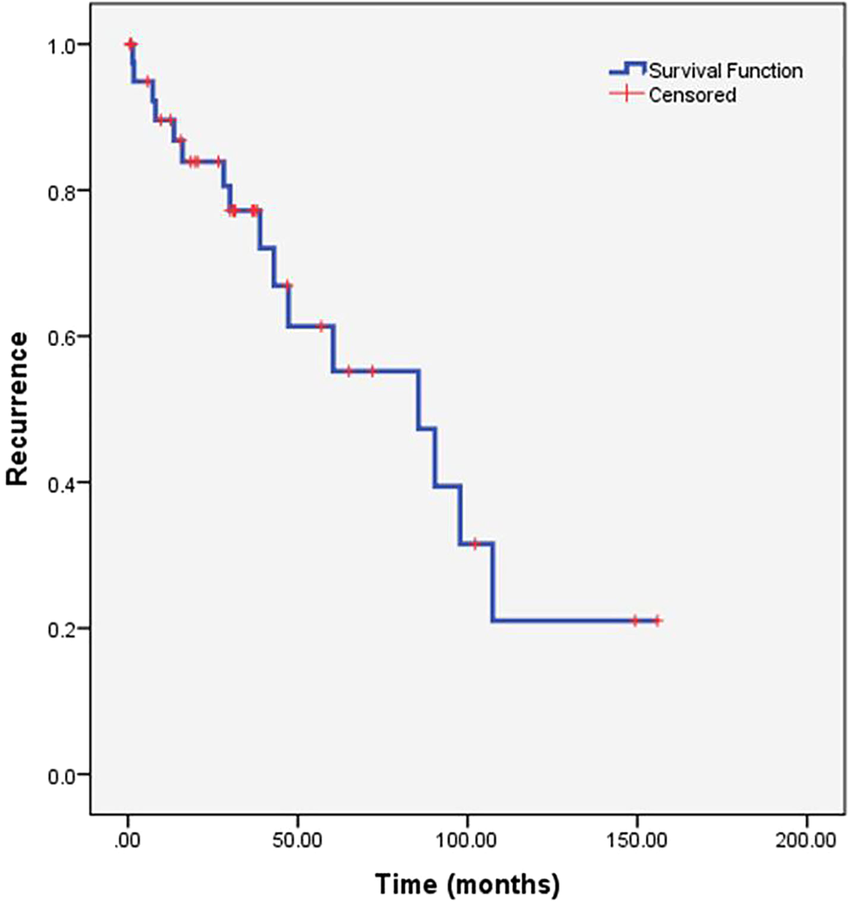
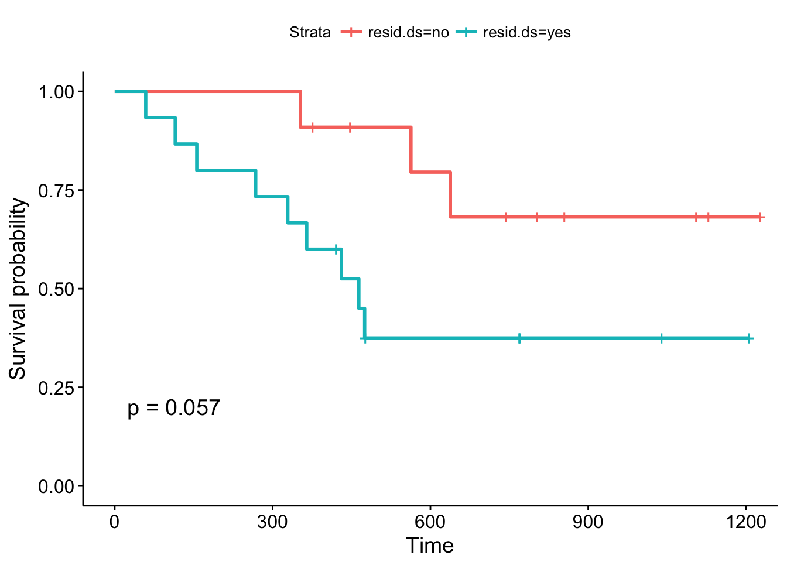

---
title: 결혼과 이혼률, 그리고 생존분석
date: 2025-07-27
categories: [KOR, Survival Analysis (KOR)]
math: true
tags: [survival analysis, divorce rate, marriage, time to event]   # lower case 
author: <Tea Tasting Gentleman>
--- 

 가끔 인터넷을 보다보면 이혼 관련 통계가 나옵니다. 2024년 기준 결혼건수는 22만 2천건이고, 이혼건수는 9만 1천건입니다. 그래서 혹자는 이혼률이 40.1퍼센트라고 생각합니다.

 외국인과의 결혼 건수는 약 2만 1천건 이혼 건수는 약 6천 건입니다. 이를 통해 혹자는 외국인과 결혼을 했을 때 이혼률이 28.6퍼센트라고 주장합니다. 그렇기 때문에 대한민국 사람끼리 결혼하는 것보다는 외국인과 결혼하는 것이 좋다고 주장하기도 합니다.

 그렇다면, 이혼률을 이처럼 정의할 수 있을까요? 이혼을 event라고 하고, 이혼까지 걸리는 시간을 time-to-event, 결혼이 지속되는 상황을 ‘생존’이라고 표현한다면 생존분석을 해볼 수 있지 않을까요? 더불어 대한민국 부부와 외국인과의 부부 중에 누가 결혼생활을 오래하고 지속하는지 어떻게 분석할 수 있을까요?

 결혼 및 이혼 데이터는 각 데이터들의 시작 시점이 각각 다르고 이혼할 때까지의 기간이 모두 다릅니다. Time-to-event 데이터로 봐야 합니다. 결혼하고 나서, 이혼할 때까지 기간이 정의되고, event 여부가 정의됩니다. 실제로 이혼을 하면 event가 발생한 것이고, 우리나라에서 외국으로 국적을 변경하거나 사망한 경우에 중도절단(censoring)이 되겠지요.

 그러면 위에서 언급한 이혼률은 어떻게 생각해볼 수 있을까요? 결혼 시점으로부터 이혼할 때까지의 기간이 모두 다르기 때문에, 결혼 후 1년 이혼률, 3년 이혼률, 5년 이혼률 등을 생각해볼 수 있겠지요. 전체 결혼 기간에 대해서 중도절단과 event 발생까지 고려한 Kaplan-Meier plot을 그려볼 수 있습니다. 생존 기간에 따른 이혼 발생을 한 눈에 확인할 수 있는 curve입니다. 이때 생존률은 추정 공식을 활용하여 계산합니다. 관심 있으신 분들은 Kaplan-Meier estimator를 확인해보시면 됩니다. Kaplan-Meier estimator를 활용하여 결혼 후 1년 이혼률, 3년 이혼률, 5년 이혼률을 추정해볼 수 있습니다. 아래 그림이 Kaplan-Meier plot 예시입니다.

[Reference link](https://www.researchgate.net/figure/Kaplan-Meier-curve-for-freedom-from-the-first-recurrence-of-thrombosis-Kaplan-Meier_fig2_358085115)

 여기서 더 나아가 한국인 부부와 한국인과 외국인 부부의 생존 곡선을 비교하고 싶을 때에도 Kaplan-Meier plot을 그려볼 수 있습니다. 다음과 같이 두 생존 곡선을 한 눈에 확인할 수 있습니다.

[Reference link](https://www.datacamp.com/tutorial/survival-analysis-R)

이렇게 한 눈으로 확인하는 방법도 있고, 위험함수를 비모수적인 방법으로 추정하고, 각 집단 사이의 위험 비(ratio)가 follow-up동안 일정하다고 가정하고 추정하는 Cox proportional hazards regression 방법이 있습니다. 추정 결과에서 위험비 (hazard ratio)와 신뢰구간을 구해서 신뢰구간이 1을 포함하는지, 위험비가 1보다 큰지 작은지, 위험비의 크기가 얼마나 되는지를 확인하지요. 예를 들어, 한국인 부부 군에 비해 외국인+한국인 부부의 위험비가 1보다 크다는 것은 외국인+한국인 부부가 한국인 부부에 비해서 좀 더 이른 시기에 이혼을 하거나 이혼을 많이 한다는 의미입니다.

제가 길게 생존분석에 대한 이야기를 했지만, 위에서 언급한 개개인의 결혼 후 생존기간, 이혼 여부, 중도절단 여부 등의 정보가 없기 때문에 한국인 부부와 한국인+외국인 부부의 생존 곡선을 비교할 수 없고, 또 Cox regression을 해볼 수는 없습니다. 다만, 단편적인 자료를 가지고 이야기하기에는 어렵다는 것을 말씀드리고 싶었습니다.

 