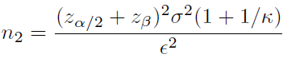

---
title: 통계적 우월성 검정 가설 설정 (단측 검정 vs 양측 검정)
date: 2025-09-28
categories: [KOR,Clinical Trial Designs]
math: true
tags: [clinical trial]  # lower case 
author: <Tea Tasting Lady>
--- 

통계적 우월성(Statisitcal superiority)을 보이는 것이 성공기준(success criteria)일 때의 인허가 임상연구에서 가설 설정에 대해 소개해보려고 합니다.  
  
제가 통계 분석을 담당했고 2023년에 US FDA의 승인을  득한 Lunit Insight DBT 제품 임상 연구 계획서(Protocol) 작성 시 논의되었던 내용이기도 합니다.  
  
그 연구의 목표는 Multi-Reader study에서 AUC로 평가되는  DBT 영상의 판독 성능(암병변 유무의 구분)이 회사 제품을 사용하여 판독보조를 받은 경우(With AI: Test2)가 판독 보조를 받지 않은 경우(Without AI: Test1)에 비해  통계적으로 유의하게 높음을 보이는 것이었습니다.  
  
Test1에 비해 Test2의 AUC가 통계적으로  유의하게 더 높음을 보이고자 하는 상황인데  연구 가설은 대립 가설(H1)이 superiority 가설(H1: test 1 < test 2)이 아닌 차이 가설(H1: test 1 not equal to test2)로 설정하였습니다.  
  
0이 아닌 어떤 특정한 값(가령, 비열등성 마진 non-inferiority margin)을  기준으로 통계 가설을 설정하는 비열등성 연구의 경우에는  단측 검정(one sided test)을 사용하고 결과 판정도 양측 95%  신뢰구간이 아닌 단측 97.5% 신뢰구간의 하한과 비열등성 마진을 비교하라고 ICH E9이나 FDA Guidance에 명확히 명시되어 있습니다.  
  
하지만, 통계적인 우월성 여부(statistical significance)를  평가(difference = 0 기준으로 비교)하는 경우에는  양측 검정(two-sided test) 또는 단측 검정(one-sided test) 중 어떤 방법을 사용할 것인지에 대해 명확히 정해져 있지 않습니다.  
  
가령, ICH E9(Statistical Principles for Clinical Trials)의  5.5 Estimation, Confidence Intervals and Hypothesis Testing 항목에선  "(통계) 추론에 단측 검정 또는 양측 검정을 적용할 것인지에 대해서는 논쟁이 있으며 통계 문헌에서도 여러 다양한 견해가 확인된다 (The issue of one-sided or two-sided approaches to inference  is controversial and a diversity of views can be found in the statistical literature)"라고 언급되어 있습니다. 
CPMP2000(Points to consider on switching between  superiority and non-inferiority)의 II.1 Superiority trial 항목에서도  "우월성 시험은 치료법 간 차이가 있는 지를 탐지하기 위해  설계되었다. 분석의 첫 단계에서 두 치료법 간 임상적 효과 차이가 없다는 가정에 대해 통계적으로 유의한 차이가 있었는 지 여부를 평가한다 (A superiority trial is designed to detect a difference between treatments. The first step of the analysis is usually a test of statistical significance  to evaluate whether the results of the trial are consistent with the  assumption of there being no difference in the clinical  effect of the two treatments.) " 로 우선 차이(difference)에 대한  통계적 유의성을 확인하고 그 차이에 대한 양측 95% 신뢰구간을 함께 제시하라고도 명시되어 있습니다.  
  
DBT 연구 Protocol에서는 성공 기준(Success Criteria)을  "If the p-value of the differences between reading  unassisted CAD and assisted CAD are  less than the significance level of 5% (0.05) and  the lower bound of two-sided 95% CI (Confidence Interval) of  the difference (Test 2 – Test 1) is above 0,  the study can be considered as “within the success criteria”로 기술을 해서, 양측 검정의 p-value가 0.05 미만이고 0보다 차이가 통계적으로 크면(95% 신뢰구간 하한이 0을 초과하는 지를 평가) 성공 기준을 만족하는 것으로 기술하였습니다.  
  
Superiority trial의 경우는 0을 기준으로 superior 여부를  평가하는(즉, statistical superiority) 것과 임상적으로  의미 있는, 0이 아닌 어떤 값(우월성 마진)을 기준으로  차이가 superior 한지 여부를 평가하는 경우 모두에 대해서  'superiority trial'이란 용어가 혼재되어 사용되고 있고  Clinical trial과 관련된 ICH나 EMEA guidance에 명시된 내용들을 감안할 때 통계적 우월성의 경우, 양측 검정의 적용이 가능합니다.  
  
차이 검정(Test for Equality), 즉 양측 검정에서 유의수준 5%를 설정하는 것과  단측 검정인 우월성 검정(Test for Superiority)을 선택하게 되면 Sample size 결과가 달라지는 것이 아닌지에 대한 질문도 받았었는데요,  
  
아래의 Sample size 공식은 양측 검정(Test for Equality)에  대한 공식으로, 설정한 유의수준 alpha가 Zalpha/2 로 반영되어  
있습니다.

Sample size 계산은 Test for Equality인 경우에는 양측 검정에서의 alpha/2 = 0.025, Non-inferiority/ Superiority의 경우에는 단측 검정임을 반영하여 
alpha = 0.025를 사용하기 때문에 결과적으로 sample size 계산 결과는 동일합니다.

## Reference
-  ICH Topic E9 Statistical Principles for Clinical Trials Step 5 
	- https://www.ema.europa.eu/en/documents/scientific-guideline/ich-e-9-statistical-principles-clinical-trials-step-5_en.pdf
-  CPMP Points to Consider on Switching between Superiority and Non-inferiority
	- https://www.ema.europa.eu/en/documents/scientific-guideline/points-consider-switching-between-superiority-and-non-inferiority_en.pdf