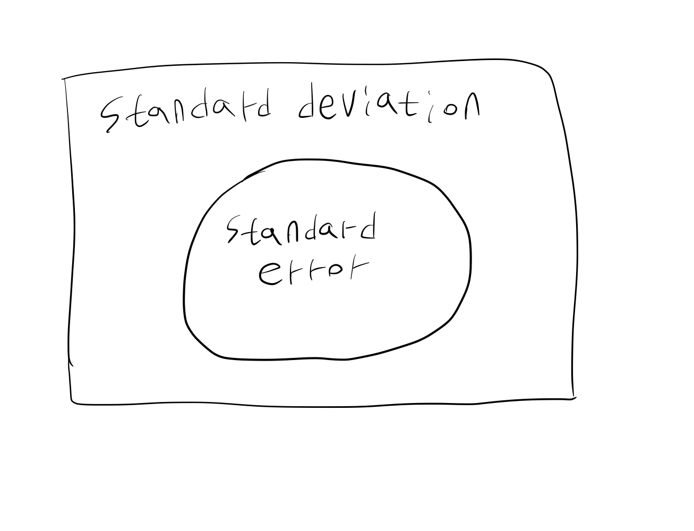

---
title: 표준편차와 표준오차
date: 2025-10-03
categories: [KOR,etc (KOR)]
math: true
tags: [standard deviation, standard error]  # lower case 
author: <Tea Tasting Gentleman>
--- 
통계학과 의학에서 표준편차와 표준오차는 자주 나오는 개념이다. 표준편차(standard deviation)은 자료의 퍼진 정도를 나타내는 데 좋은 metric이다. 표준편차는 편차의 제곱의 평균의 제곱근으로 정의된다. 우리가 흔히 이야기하는 분산은 편차의 제곱의 평균이다. 

그렇다면 표준 오차 (standard error)는 무엇인가? 표준오차 역시 표준편차이다. 그런데 통계량 (statistic)의 표준편차이기 때문에 일반적으로 말하는 표준편차보다는 좁은 개념이다. 예를 들어, 표본으로부터 구한 평균, 분산 등이 통계량에 해당한다. 이때, 통계량의 표준편차를 이야기할 수 있다. 모수 추론 과정에서 발생하는 불확실성을 정량화하는 개념이다. 이는 빈도주의든 베이지안이든 해당하는 이야기이다. 

예를 들어, 통계량(예: 표본 평균)의 95% 신뢰구간은 표준오차 (통계량의 표준편차)를 활용해서 구한다. 중심극한정리가 적용될 수 있는 데이터라고 하면, 표준오차는 표본의 표준편차에서 표본수의 제곱근으로 나눈 값이 된다. 즉 표본수가 클수록 표준오차는 작아지게 된다. 그리고 표본수가 충분히 크다면 통계량의 분포를 정규분포로 근사하고 95% 신뢰구간은 표본평균 ± 1.96 × 표준오차로 구할 수 있다. 표준오차가 작아지면 95% 신뢰구간의 길이가 짧아지게 된다.

평균을 막대 그래프나 선 그래프로 표시하는 경우가 종종 있는데, 이때 표준편차를 표시하기보다는 표준오차를 표시하는 경우가 많다. 왜냐하면 표준오차는 위에서 언급한 것처럼 95% 신뢰구간과 직접적인 관계가 있는 개념이기 때문이다. 그리고 일반적으로 표준오차가 표준편차보다 작기 때문에 그래프에 표시하기도 예쁘다.
정리하자면, 표준편차는 데이터의 퍼진 정도를 이야기하는 큰 개념이고, 표준오차는 통계량의 퍼진 정도를 이야기하는 개념이다. 둘 다 표준편차이다.

