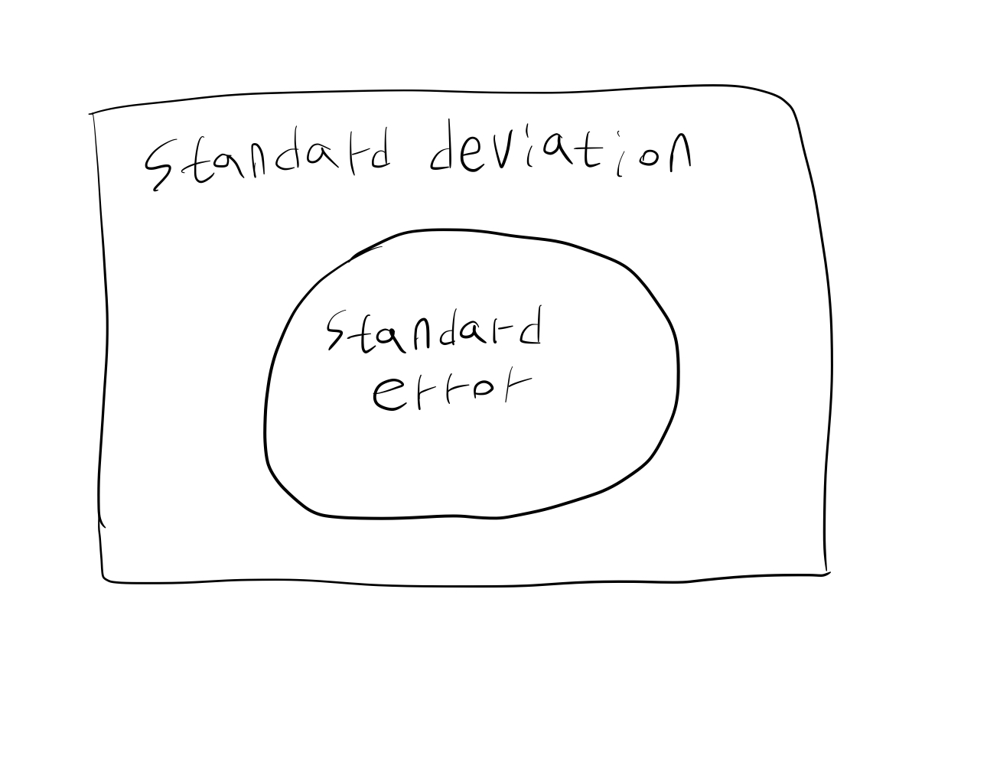

---
title: Standard deviation and standard error
date: 2025-10-03
categories: [ENG,etc]
math: true
tags: [standard deviation, standard error]  # lower case 
author: <Tea Tasting Gentleman>
--- 
In statistics, standard deviation and standard error are frequently used concepts. They are also commonly seen in medical research and papers. Standard deviation is a good metric for representing the degree of data dispersion. Standard deviation is defined as the square root of the mean of squared deviations. Variance, which we commonly talk about, is the mean of squared deviations.

So what is standard error? Standard error is also a standard deviation. However, because it is the standard deviation of a statistic, it is a narrower concept than the standard deviation we generally refer to. For example, the sample mean and sample variance obtained from a sample are statistic. In this case, we can talk about the standard deviation of the statistic. It is a concept that quantifies the uncertainty that occurs in the inference process of parameter. This applies whether we're talking about frequentist or Bayesian approaches.

For example, the 95% confidence interval of a statistic (e.g., sample mean) is calculated using the standard error (the standard deviation of the statistic). For data where the central limit theorem can be applied, the standard error is the sample standard deviation divided by the square root of the sample size. In other words, the larger the sample size, the smaller the standard error. And if the sample size is sufficiently large, we can approximate the distribution of the statistic with a normal distribution, and the 95% confidence interval can be calculated as sample mean ± 1.96 × standard error. As the standard error decreases, the length of the 95% confidence interval becomes shorter.

When displaying means in bar graphs or line graphs, standard error is often displayed rather than standard deviation. This is because, as mentioned above, standard error is directly related to the 95% confidence interval. Also, since standard error is generally smaller than standard deviation, it looks prettier when displayed on graphs.

To summarize, standard deviation is a broad concept that refers to the degree of data dispersion, while standard error is a concept that refers to the degree of dispersion of statistic. Both are standard deviations.

