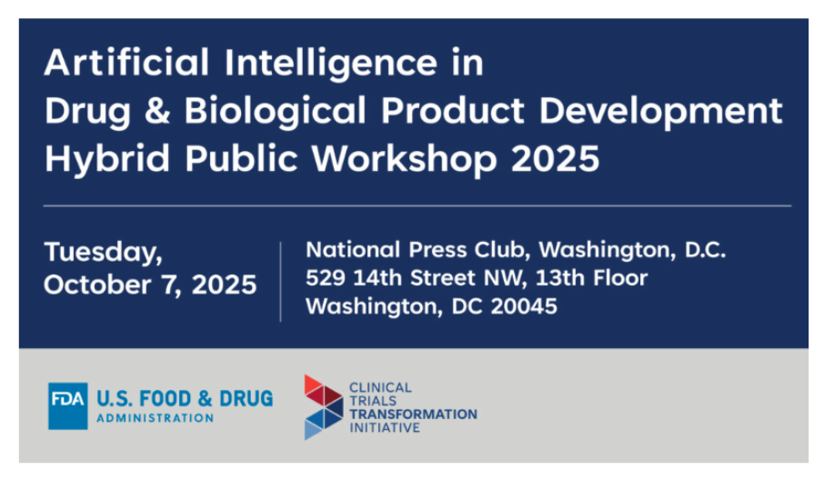
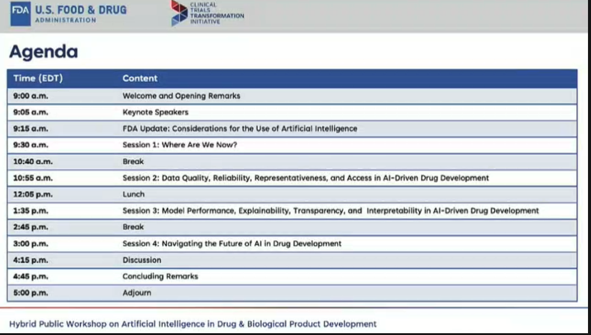
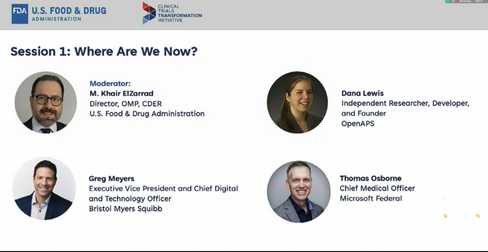

---
title: Session1_AI in Drug & Biological Product Development Hybrid Public Workshop 2025
date: 2025-10-09
categories: [KOR, etc (KOR)]
tags: [korean]   # lower case 
author: <Tea Tasting Lady>
math: true
--- 
# AI in Drug & Biological Product Development Hybrid Public Workshop 2025

## Introduction
- AI/ML 적용은 아직 초기 단계가 대부분임 
- Data Quality, governance, compliance of regulatory compliance 에 대한 concern 이 많음 
- Perception of AI is really important 
- AI를 활용한 Innovation 을 어떻게 support 할 것인가? 

## Keynotes  
### by Shantanu Nundy
- Advisor on Artificial Intelligence(Contractor), Office of the Commissioner, U.S. FDA 
- FDA의 mission 은 promote and protect health 
- AI는 두가지 모두를 할 능력이 있음 
- 15년 동안 이 분야에서 일을 해온 내 경험에서는 이런 자리가 정말 중요하다고 느낌
#### Accelerating AI in Drug Development
- Real World Data and evidence
- Reduce animal testing and model toxicity
- AI-enabled endpoints and biomarkers
- Clinical trial design
- Clinical Trial Enrollment

### by M. Khair Elzarrd
- Director, Office of Medical Policy (OMP), Center for Drug Evaluation and Research (CDER), U.S. FDA 
- Innovation means additional risks
- Increasing engagements 가 주 목표 
	- 지금은 listening, interview 등에 의존하지만, 더 나은 방법을 찾아가고 싶음 
	- FDA는 데이터가 필요함
		- early engagement is very critical 
- Transparency
	- 어떻게 모델이 동작하고 왜 동작하지 않는 지에 대한 이해가 필요함
	- 이를 위해 transparency 가 중요함
- Data Governance
	- 데이터를 모으고 수집하는 데 중요함
- Context of use 
	- 맥락 중요함 
	- 어떤 상황에서 사용되고 하는 지에 대한 이해가 필요함 
- Mutlidisciplinary review
	- 다양한 분야 전문가의 필요한 의견을 어떻게 적시에 받을 수 있을 것인지? 
	- Rapid engagement 를 어떻게 가능하게 할 것인지? 
- Global Harmonization
	- 여전히 국제 조화가 이루어지고 있지 않음 
	- privacy 에 대한 이견도 국가별로 다름 
	- 지역별 규제기관의 견해도 서로 다름 
- Upskilling
	- 우리가 현재 중요하게 배우고 있는 부분임
	- 우리도 또한 기술을 이해하기 위해 많이 노력하고 있음 
- Responsive Infrastructure 
	- 데이터의 규모가 엄청나게 커질 것임(terabyte)
	- 기관의 Infrastructure 가 data sharing 등을 뒷받침할 수 있어야 함 
- Guidance
	- 이제 3,4년에 한번씩 가이던스를 발표하는 방식으로는 안될 것임 
	- 우리는 AI로 인한 challenge 를 잘 맞서기 위해 노력하고 있음 

### by Gabriel Innes
- Assistant Director, Data Science and Artificial Intelligence Policy, OMP, CDER, U.S. FDA  

- 새 Guidance(Considerations for the Use of AI to Support Regulatory Decision-Making for Drug and Biological Products) 소개 
	- 7 different office center 가 협력하여 만든 guidance 임
	- 우리가 Innovative technology 에 고민하고 있음을 잘 보여주는 문서임
	- Risk based approach 에 중심을 둠 
- Fundamentals
	- Model risk 에 비례하여 risk 평가할 것을 요청함 
	- AI dynamic 이 정적(static)이 아님을 이해하고 있음 
	- FDA와 산업계가 조기에 제품의 개발에 대해 논의할 것을 요청함 
- 통합적인 문서화(comprehensive documentation)이 중요

#### The Seven Steps
- First: Define the question of Interest
- Second: Define the COU(Context Of Use?)
- Third: Assess AI model risk
- Fourth: Develop a plan to establish AI model credibility & **come to talk to us!**
- Fifth: Execute the plan, preferably after engaging with the agency
- Sixth: Document the results
- Seventh: Determine the adequacy of the AI model for the COU 

- Evaluation
	- Risk based 평가가 중요
	- model 의 결과가 잘못 된 경우 생길 수 있는 가장 큰 risk 는? 
		- 이런 판단에 따라 제품의 AI의 risk level 을 결정 
- Guidance draft version에 대해 받았던 comment들 
	- Technology 에 대해 명확히 기술해달라는 요청이 많았음
		- Generative AI 도 다루는 것인지 등등 
	- Use Case examples 에 대해 계속 자료를 수집하고 있음 
	- Regulatory Engagment 에 대한 많은 요청이 있었음
		- 우리도 많은 노력을 하고 있음
		- 업계에서도 초기 단계에서부터 FDA 와 논의를 해주었음 함 
	- Model Development & Life Cycle
		- 각 단계별로 어떤 작업이 필요할 지에 대한 요청이 많았음 
- 이번 워크숍에서 많은 의견을 직접 듣기를 원함
- 우리에게도 산업계의 의견을 들을 좋은 기회임 
- 앞으로도 계속 의미있고 유용한 Guidance 를 만들기 위해 계속 노력할 것임 

## Session 1: Where are we now? 

- by Moderator M. Khair Elzarrd 
	- 이번 세션에서 의미있는 논의가 이루어지기를 원함 
	- Panel 소개
	- Greg Meyers
		- from BMS
		- transformational science 분야의 담당자
	- Dana Lewis
		- OpenAPS의 Founder
		- Leader
		- 당뇨 연구,  췌장 부전 환자 
		- PRO에 대해서도 관심이 있음
	- Thomas Osborne
		- AI Clinical Innovation 의 선구자
		- Standford 교수 , CMO in Microsoft Federal
		- Technology 와 Health 의 integration 에 관심이 많음 

### AI in Drug & Biological Development by Greg Meyers
- 제품 개발(Product Development) 단계에서의 AI 활용 기회 
	- 어떻게 개발 일정을 줄일 수 있을지? 
	- 제조 단계에서의 일정을 얼마나 줄일 수 있을까?
- Causal human biology
	- Human level 에서의 variability 가 큼 
	- 질병에 대한 이해가 중요함
	- 3D printer 로 cell 에 대한 실험을 할 수 있음 
		- In silico simulation 이 가능
- Matching modality to mechanism 
	- AI/ML solution: Accelerated virtual screening and ML-guided MPO with dynamic profiling 
	- AI가 lead optimization 등에 도움을 주고 있음
	- Molecule design 에 AI 활용가능
		- e.g., brain barrier 를 투과할 수 있는 molecule 의 개발에 적용 등
		- 실험을 in silico setting 에서 진행
- Path to clinical proof of concept 
	- AI 를 활용하여 광대한 data에서 tumor 에 대한 이해를 할 수 있음
- AI is useful at every stage of clinical development 
	- MTD (Maximal Tolerated Dose)의 추정에도 AI simulation 활용 가능
	- Real world understanding 에도 도움이 됨 
	- Statistical rigor 를 확보하면서도 patient 의 어려움을 줄이는 데에 도움이 될 것임 
	- Digital biomarker의 활용도 점점 증가할 것임 
- AI based Parameter Optimization within manufacturing 
	- 약물 제조 단계에서도 AI의 활용이 가능
	- 제조 가능에서 확보 가능한 많은 데이터를 이용하여 수율의 최대화(maximize yield)를 하는 데 적용 가능

### Presentation by Dana 
- 우리가 AI를 앞으로 가장 잘 활용할 수 있는 부분은 어떤 영역일지?
	- Problem/disease에 대해 아직 잘 알려져 있지 않아 training이 잘 되지 않은 영역 
- A study on LLMs & Chart Notes 
	- 실제 질문을 구성하여 3 LLMs 이 답변하게 함 
	- Prompt mattered
	- 어떤 prompt 를 사용하는 지에 따라 답변의 내용, level 이 달라졌음 
- How to titrate when titration hasn't been studied? 
	- 동물에 대한 정보를 페북에서 보고 본인의 증상에 대입하여 본인이 해당 증상(Exocrine pancreatic insufficiency)이 실제 있는 것을 알게 되었음
	- 동물 실험의 결과를 human 에게 어떻게 titrate 하여 해석할 수 있을지? 
	- Symptom score 를 구성하여 비교하게 함
		- 이 경우, EPI 여부를 AUC 0.86 으로 구분할 수 있었음
		- 이전에는 metric, 관련 study 등이 존재하지 않았었음 
- PERT Pilot (Pancreatic Enzyme Replacement Therapy)
	- 본인의 질환 치료를 위해 Personal use 목적의 app을 개발하여 배포하게 됨
	- 이제 AI를 활용하여 이런 형태의 app 을 배포하고 better decision 을 환자가 내리는 데 도움을 줄 수 있음
- Let's think about
	- Regulators
		- Make sure policies Dana't penalize for RWE
		- Make easier pathways for repurposing
	- Companies & Researchers
		- Record & Retain & Report more granular data
		- Make open datasets... and use pre-prints
		- Actually make data available
		- create pathways to draw in real-world data
		- Existing drugs still have a lot of room for improvment 		
### Presentation by Thomas
- 우리는 현재 변환점(inflection point)에 와 있음 
- FDA가 이런 논의를 할 기회를 준 것에 감사함
- How is biomedical knowledge generated? & How AI can help? 
	- Linear 하게 발전하는 것이 아님
	- cross talk 과정이 존재함 
	- ML vs LLM 
		- 분리된 것이 아님
		- 서로 영향을 주면서 발전할 수 있음 
- Preclinical
	- 단백질 구조의 예측이 이미 가능함
- Clinical
	- 환자 등록이 큰 어려움임 
	- 이 때 Multi-Agent 의 활용이 가능할 것임
		- 전통적인 tumor board 활용 대신 
	- Adaptive trial design 을 활용하여 환자의 안전성 확보 및 임상시험의 효율을 올릴 수 있음 
	- 충분히 데이터가 모이면 수정구슬처럼 질병의 발생확률을 더 정확히 예측할 수 있을 것임

### Panel Discussion 
- by Moderator
	- Greg에게 질문이 있습니다. 새로운 방식을 제안하고 있는데, 전통적인 drug development 와 대비하여 어떻게 과정이 바뀌고 있는지 설명해주세요
		- Greg
			- design optimal protocol에 활용 가능함
				- historically, protocol 의 작성단계에서 natural inconsistency 가 존재했었음
				- CVD trial 을 그 동안 많이 해왔는데, AI에게 분석을 해보았을 때, 다른 biomarker 의 영향이 예상보다 컸었음 Historical approach 와는 다른 패턴이었음 
					- more database 를 활용하면 더 효율적인 임상 진행이 가능할 것임 
					- 환자 enrollment 도 실시간으로 예측 가능
						- drop out 가능성에 대한 평가가 정밀해짐 
			- 임상시험에서 환자 enrollment process 에 도움을 줄 수 있음 
				- sites 에 대한 세밀한 평가가 가능해짐
				- oversight 의 효율이 올라갈 수 있음 
			- Being able to predict, build a model for screening failure 평가
				- screening failure 에 대해 미리 예측한 후 미리(prospectively) 대응이 가능하게 될 것임
				- 이전의 관례에서는 이미 기관에서 일이(저조한 등록 과 같은...) 발생한 후에 대응할 수 밖에 없었음 
	- Dana 에게 질문. 환자 입장에서 AI를 활용하는 것에 대한 발표가 정말 인상적이었습니다. Use case 에 기반하여 patient researchers 가 어떤 관점을 제공해 줄 수 있을 지 궁금. 
		- by Dana
			- 환자가 결정권을 얻고 치료 결정에 대한 의견을 낼 수 있게 하는 구조에 도움을 줄 수 있음 
		- by Thomas
			- 어떤 구조로 그런 걸 만들 수 있을지에 대해 궁금함 
		- by Dana
			- 산업계에서 환자가 목소리를 낼 수 있는 구조에 대한 고민이 필요함 
	- Thomas 에게 질문. 본인이 생각하는 가장 유망한 AI의 use는? (most potential promise that AI can be used)
		- by Thomas
			- 현재 사용되고 있는 여러 tool 이 있지만, real power 는 collaboration 을 유용하게 하는 것에 있음
			- 현재 여러 연구들은 분리되어 이루어지고 holistic view 에서 이루어지고 있지 않고 silo 가 존재하지만 AI를 잘 활용하면 이런 문제를 해결할 수 있을 것임
			- share information, data, techniques 를 할 domain 이 현재는 부족함
			- AI를 활용하여 현재 10 ~ 15년이 걸리는 신약 개발 절차를 가속화할 수 있다면 큰 혁신(major breakthroughs)이 될 것임 
	- Dana에게 질문. Regulator 에 대한 관점이 궁금함. Regulator 가 가져야 할 중요한 관점이 무엇일지 궁금함. 
		- by Dana
			- Real world evidence 에 대한 논의가 정말 인상적이었음
			- 나도 researcher 이자 환자로써 여러 연구 과정에서 소외되는 것이 아쉬웠음
				- 당뇨병 환자는 매우 complex 한 그룹임
				- 임상 연구에서 아예 제외됨. (off label group이 되어버림)
			- Risk based modeling 을 활용하여 소외된 질병환자군에 대한 고려가 더 빨리 될 수 없는 것인지?
				- Type I diabetes 환자로 아쉬운 적이 많음
				- 혈당이 높으면 신약의 적용을 아예 받을 수 없는 것인지?
				- data 활용을 통해 그런 적용을 AI가 더 쉽게 할 수 있지 않을까 하는 기대가 있음 
			- Label 에 반영할 경로를 regulator 가 고려해야 함 
			- Data availability 가 더 넓어졌음 함
		- by Greg
			- digital therapeutics 
			- in risk profiles, safety profiles, add home monitoring 등의 적용이 가능할 것임
			- Biomarker 의 발견(respiratory symptom,heart variability 등의 측정)이 더 많아질 것임 
			- 아직 Functional pathway 가 존재하지 않음
			- BMS 가 prediction model 를 만들더라도 환자가 바로 benefit 을 얻을 수 있도록 하기는 어려움 
				- FDA가 이런 시도에 incentive 를 줄 수 있어야 함
			- small specialty group을 임상시험에 포함할 경우, 부작용, 안전성 profile 에 큰 부정적인 영향을 줄 수 있어 포함을 시키는 것이 조심스러움
		- by Thomas
			- high level issue 는 비용 그리고 속도(speed) 임
			- 우리가 약간 다른 approach 를 취한다면 바뀔 수 있을 것들이 있음
			- data의 access뿐만 아니라 data의 normalize, cleaning 등도 있어야 함
			- 모두가 same level에서 자료를 수집하고 비교할 수 있다면 효율성이 올라갈 것임
			- 하지만 쉽지 않은 것이 모두가 데이터를 공유하려고 하는 것은 아님
			- small group 에서 얻은 data를 통합하고 personalize 하려고 할 때 blind spot 여부를 현재는 명확히 알 수 없음 
			- Rule, incentive, regulatory pressure 등을 통해 public good 을 위해 데이터를 활용할 수 있어야 함 
		- by Greg
			- NIH grant 를 활용할 경우 결과를 공유해야 한다는 것이 new White AI  선언에 있었음 
			- 산업계가 on board 
			- public - industry 의 협력이 필요함
		- by Dana
			- AI를 잘 활용할 경우, 표준화된 데이터의 수집, 해석이 훨씬 용이해질 것임
			- 현재부터 데이터의 수집을 시작해야 함
			- When something is flattened, AI, LLM은 데이터가 없을 경우 어떤 결론을 내릴 수 없음
			- 아직 어떻게 데이터를 활용할 지 모르더라도 데이터의 수집은 지금부터라도 당장 시작할 수 있어야 함 
		- by Greg
			- Study fails, nobody cares about sharing data
			- 우리는 과학자로써, 실패한 임상시험에 대한 retrospective analysis 도 필요할 것임
			- Explosion of data
			- AI's ability to clean 은 중요, human 이 하지 못했던 작업을 훨씬 효율적으로 할 수 있을 것임 
		- by Dana
			- Safety profiling 에 대한 정보 없이 약물의 사용이 어려웠음
			- negative result 에 대한 분석도 매우 유용할 것임 
			- 실패한 임상시험의 자료도 매우 유용할 것임 
	- by Moderator: 매우 인상적인 논의였음
		- by Thomas
			- 임상시험에서의 negative result 를 아예 보고하지 않았던 것도 다시 활용이 필요함 
		- by Dana
			- Chronic Pancreatic 질환이 있는 환자로써 본인 경험 공유
			- AI scribe 를 활용하여 실수가 있을 경우 어떻게 수정할 것인지?
			- Risk of AI만을 이야기할 것이 아니라 human error 에 대한 것도 솔직히 평가, 공유할 수 있어야 함 
			- AI가 fix 를 하는 것을 적극적으로 활용하면 전반적으로 error의 net reduction 이 있을 것임
		- by Greg
			- AI가 이제는 human mistake 를 찾아내는 상황이 됨
			- 몇년 전에는 human 이 AI의 mistake 를 찾아냈었음 
			- AI가 궁극적으로는 human error 를 잡아내고 교정하는 수준에 이를 것임
				- 현재는 중간 단계 
	- by Moderator
		- Critical element 가 향후 몇년은 무엇일지?
		- by Dana
			- AI활용으로 어떤 benefit, opportunities 가 있을 지 솔직히 논의할 수 있어야 함
			- 많은 사람들이 1개 이상의 질환이 있음
			- AI, human decision 이 혼재할 것임
			- 시간이 많지 않음
			- 현재 고통을 받는 사람들이 많이 존재함
			- 시장에 유효한 치료법이 빨리 활용될 수 있도록 해야함
			- 다양한 방식으로 AI가 human 을 도울 수 있도록 적극 활용되어야 함
		- by Greg
			- Federated learning 을 통해 AI 의 효율성을 높일 수 있음
			- IP의 문제가 있으나...
			- new technology 의 활용이 핵심임
			- 기술을 적극적으로 활용하여 데이터의 공유를 활성화하고 이용하는 데 적극적이어야 함
			- AI가 중립적인 3자(neutral third party)로써 도움을 줄 수 있을 것임
		- by Thomas
			- 기술은 현재 매우 빨리 발전하고 있음. 압도적임. 
			- 현재 tool 이 부족한 것이 아니라 people, process, data 를 효율적으로 활용하는 것이 중요함
			- fly wheel 을 돌리려면 education, training 이 중요함 
		- by Greg
			- people is the hardest problem 
			- people is great barrier to adopting AI
			- Bringing AI in manufacturing process 는 어려움
				- 무엇이 가능하고 무엇이 가능하지 않을지?
				- Risk 가 무엇일지?
		- by Dana
			- 우리가 왜 기존에 하던 대로 연구하고 데이터를 수집해야 하나?
			- AI가 여러 일을 더 쉽게 할 수 있을 능력이 있음 
			- 방송을 듣는 여러분도 어떻게 AI를 잘 활용할 수 있을지 고민하면 좋겠음
			- 물론 status quo를 깨는 것은 어렵지만, 바꾸도록 해야 함

