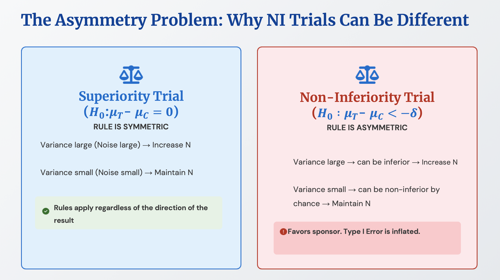

---
title: Connection between noncomparative adaptive design and estimand framework
date: 2025-11-15
categories: [ENG, Clinical Trial Designs (ENG), Advanced designs for clinical trial (ENG)]
tags: [clinical trial design, estimand framework, non-inferiority, superiority, intercurrent event, non-comparative]   # lower case 
author: <Tea Tasting Gentleman>
math: true
--- 
While studying the adaptive design guidelines in FDA guidance, I learned that adaptive design is also conceptually connected to the estimand framework. In adaptive design, there are cases where sample size is recalculated using the variance value of outcome event results without utilizing treatment assignment information. In other words, at pre-planned timepoints, variance information is used to decide whether to increase the sample size or leave it as is. What's important here is that this is possible in superiority trials, but there are statistical considerations for non-inferiority trials and equivalence trials.

In the case of superiority trials, if a larger variance value than originally expected in the initial sample size calculation is observed, it's judged that there is high noise in the data, and more samples are collected. If a smaller variance value than expected is observed, it's judged that there is low noise in the data and the trial proceeds as is. When noise is high, the actual treatment group results may be better or worse compared to the control group results. The only information we have is the variance value, and because the same rule is applied whether the results are good, bad, or equal, the Type I error rate remains fixed.

However, in non-inferiority trials or equivalence trials, applying the above rule increases the Type I error rate. For example, let's consider the rule that if noise is judged to be high, more samples will be collected. In non-inferiority trials, the null hypothesis is that the treatment group's effect is inferior to the control group, and variance can be large when there is inferiority. Increasing the sample size because variance is large has the effect of giving another opportunity. Conversely, if noise is judged to be low, the trial proceeds as is, which also means that low variance indicates a small difference in effect size between the two groups, resulting in outcomes favorable to the sponsor.

A similar discussion appears in the estimand framework. An estimand is a precise description of the treatment effect in the clinical question posed by a specific clinical trial's objective. Here, something called an intercurrent event is treated as important. For example, our interest is in the occurrence of diabetes, but there are cases where rescue medication is given because the control group's effect is too poor, and this can be defined as an intercurrent event.

Among strategies for handling intercurrent events, there is something called the treatment policy strategy. Even if rescue medication actually occurs, this is a method of proceeding with the analysis as if rescue medication did not occur. In superiority trials, this strategy works in the direction of narrowing the difference between the treatment group's effect and the control group's effect, so the estimand presents a more conservative estimate. Nevertheless, if statistically significant results are obtained, it proves that there is an effect despite conservative assumptions. However, in non-inferiority trials or equivalence trials, the treatment policy strategy should be used with caution. This is because it will work in the direction of reducing the difference between the two groups. This seemed similar to the non-comparative data case in adaptive design mentioned above.

